# Documentación Técnica Integral — RA Manager

## 1) Estructura de directorios (crear `Docs/Diagrama`)

```bash
cd /home/runner/work/RA_Final/RA_Final
mkdir -p Docs/Diagrama
```

## 2) Diagrama de Arquitectura

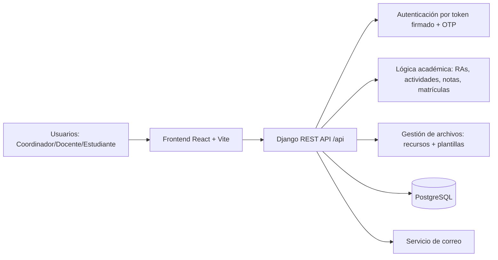

## 3) Diagrama de Componentes

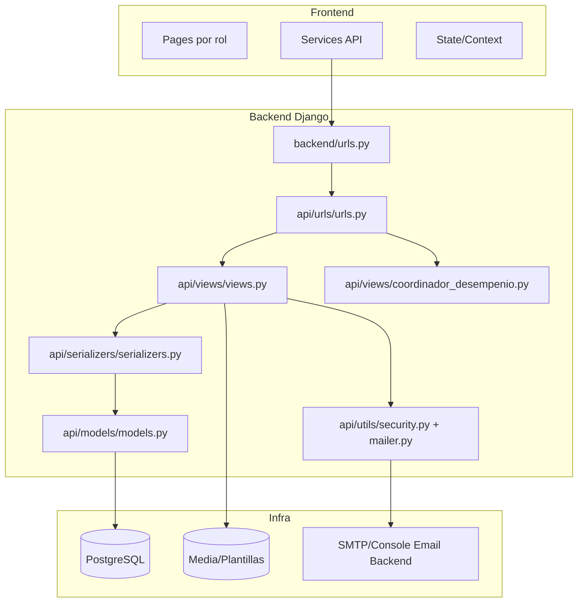

## 4) Diagrama de Clases (núcleo de dominio)

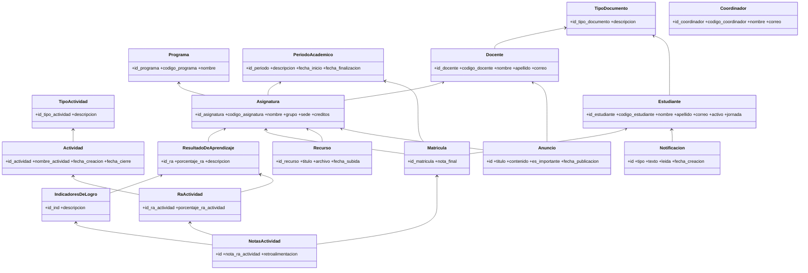

## 5) Diagrama de Objetos (estado de ejemplo)

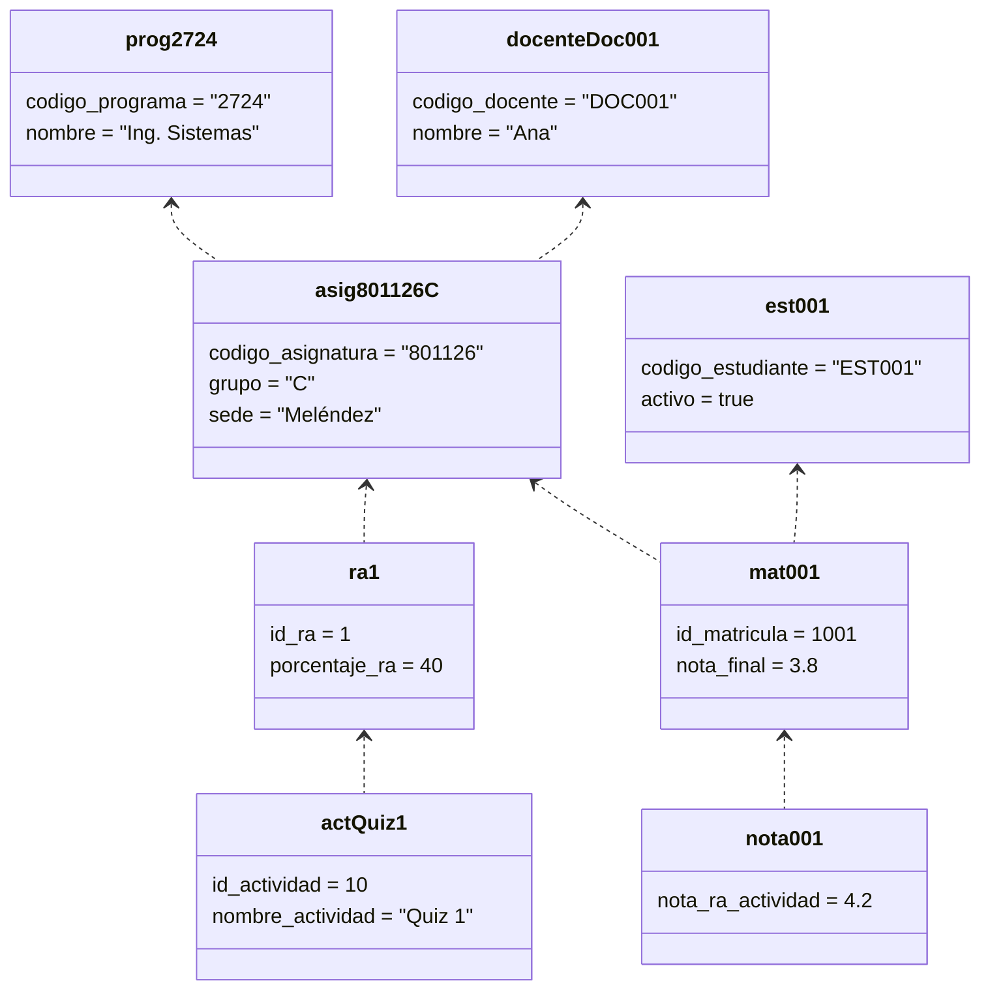

## 6) Diagrama de Flujo (flujo principal de negocio)

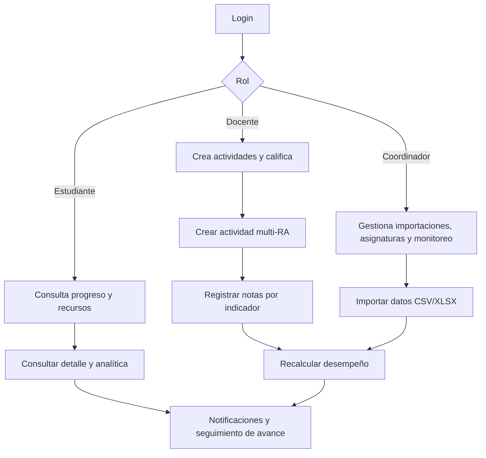

## 7) Inventario de endpoints activos

> Fuente: `backend/api/urls/urls.py` + acciones de `AsignaturaViewSet` + `coordinador_desempenio.py`.

- **Auth**: `/api/auth/login`, `/api/auth/me`, `/api/auth/logout`, `/api/auth/password/forgot`, `/api/auth/password/verify-otp`, `/api/auth/password/reset`, `/api/auth/profile`, `/api/auth/password/change`, `/api/auth/profile/avatar`
- **Catálogos/ViewSets**: `/api/tipos-documento/`, `/api/tipos-documento/{id}/`, `/api/tipos-actividad/`, `/api/tipos-actividad/{id}/`, `/api/programas/`, `/api/programas/{id}/`, `/api/docentes/`, `/api/docentes/{id}/`, `/api/estudiantes/`, `/api/estudiantes/{id}/`, `/api/asignaturas/`, `/api/asignaturas/{codigo}/`
- **Acciones de asignatura**: `/api/asignaturas/{codigo}/estudiantes/`, `/api/asignaturas/{codigo}/mi-matricula/`, `/api/asignaturas/{codigo}/periodos/`, `/api/asignaturas/{codigo}/ras/`, `/api/asignaturas/{codigo}/recursos/`, `/api/asignaturas/{codigo}/anuncios/`
- **RAs/Notas/Analítica**: `/api/ras/{ra_id}/indicadores/`, `/api/ras/{ra_id}/indicadores/crear`, `/api/ras/{ra_id}/indicadores/{ind_id}/`, `/api/ras/{ra_id}/indicadores/{ind_id}/actualizar`, `/api/ras/{ra_id}/actividades/`, `/api/ras/{ra_id}/actividades/{rel_id}/`, `/api/notas`, `/api/validacion/ra/{ra_id}`, `/api/validacion/asignatura/{codigo_asignatura}`, `/api/asignaturas/{codigo_asignatura}/estudiante/{id_estudiante}/indicadores`, `/api/asignaturas/{codigo_asignatura}/calificaciones/{id_estudiante}/`, `/api/asignaturas/{codigo_asignatura}/detalle/{id_estudiante}/`, `/api/asignaturas/{codigo_asignatura}/analitica/`, `/api/asignaturas/{codigo_asignatura}/actividades-agrupadas/`, `/api/actividades/multi`, `/api/notificaciones`, `/api/anuncios/{anuncio_id}/`
- **Coordinador**: `/api/coordinador/estudiantes`, `/api/coordinador/estudiantes/{id_estudiante}/desactivar`, `/api/coordinador/estudiantes/{id_estudiante}/activar`, `/api/coordinador/estudiantes/{id_estudiante}/jornada`, `/api/coordinador/periodos`, `/api/coordinador/estudiantes-para-matricula`, `/api/coordinador/matriculas/desmatricular`, `/api/coordinador/docentes`, `/api/coordinador/docentes/{id_docente}/perfil`, `/api/coordinador/estudiantes/{id_estudiante}/perfil`, `/api/coordinador/asignaturas`, `/api/coordinador/asignaturas/crear-ra`, `/api/coordinador/asignaturas/detalle-edicion`, `/api/coordinador/asignaturas/actualizar-ra`, `/api/coordinador/asignaturas/estudiantes`, `/api/coordinador/asignaturas/ras`, `/api/coordinador/asignaturas/avance`, `/api/coordinador/import/matriculados`, `/api/coordinador/import/docentes`, `/api/coordinador/import/estudiantes`, `/api/coordinador/import/asignaturas-ras`, `/api/coordinador/import/templates/{filename}`, `/api/coordinador/dashboard/desempenio/`
- **Docente**: `/api/docente/asignaturas/{codigo_asignatura}/import/estudiantes`, `/api/docente/buscar-estudiante`, `/api/docente/asignaturas/{codigo_asignatura}/estudiantes`
- **Documentación API**: `/api/schema/`, `/api/docs/`, `/api/redoc/`

---

## 8) Diagramas de secuencia por endpoint

### 8.1 Auth

#### Endpoint: `POST|GET /api/auth/login`
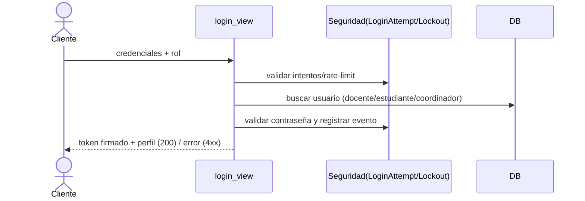

#### Endpoint: `GET /api/auth/me`
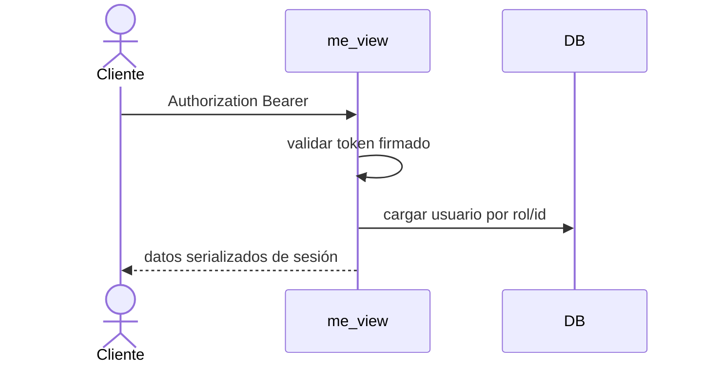

#### Endpoint: `POST|GET /api/auth/logout`
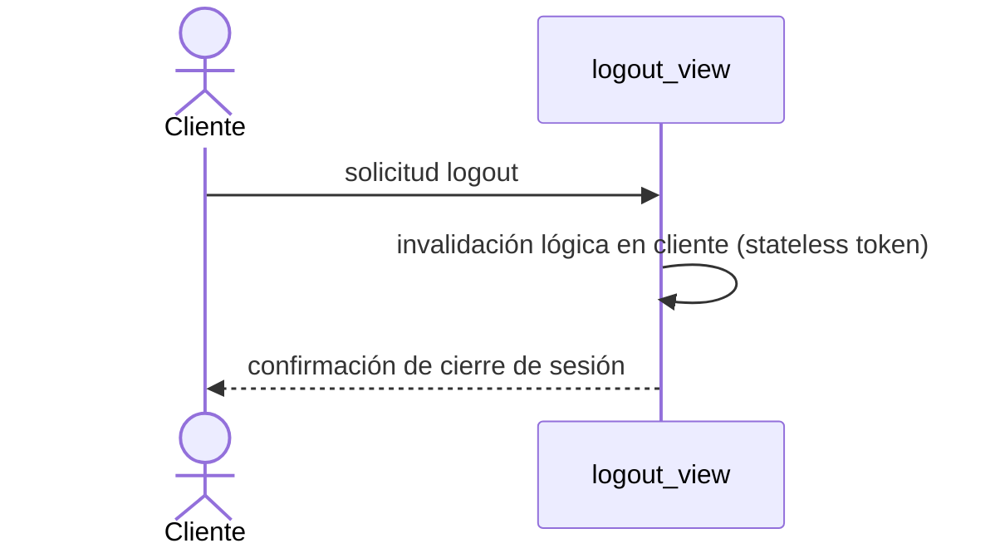

#### Endpoint: `POST /api/auth/password/forgot`
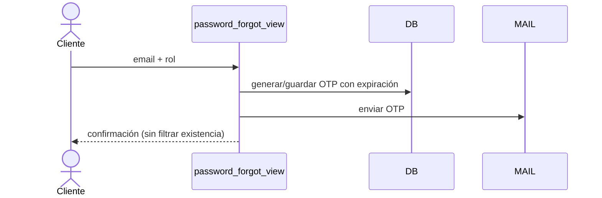

#### Endpoint: `POST /api/auth/password/verify-otp`
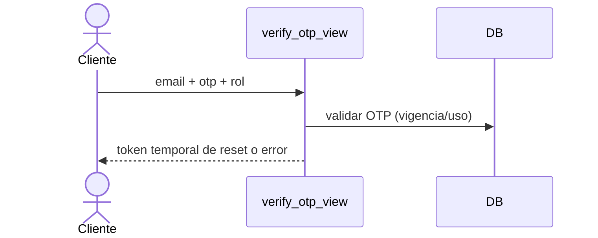

#### Endpoint: `POST /api/auth/password/reset`
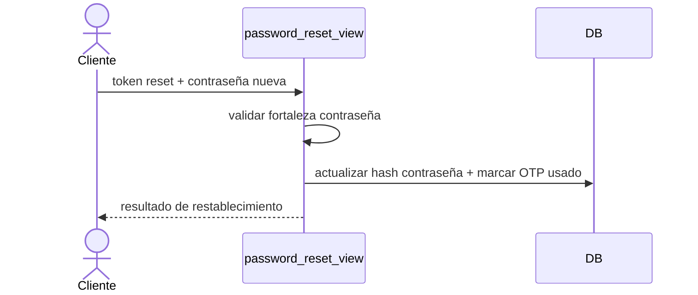

#### Endpoint: `GET|PUT|PATCH /api/auth/profile`
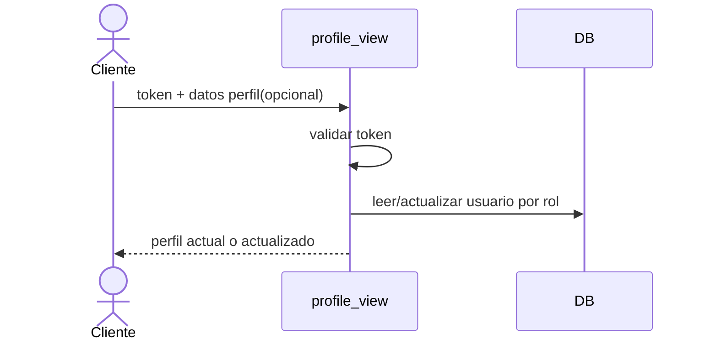

#### Endpoint: `POST /api/auth/password/change`
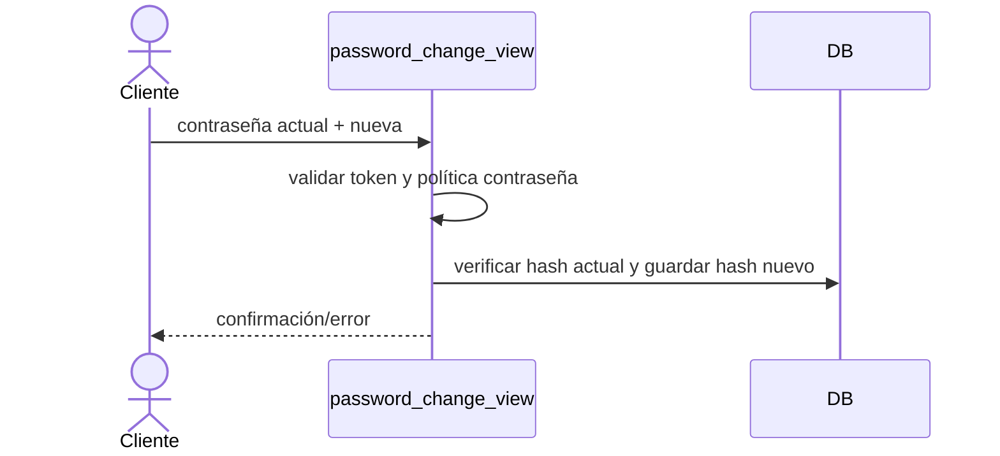

#### Endpoint: `POST /api/auth/profile/avatar`
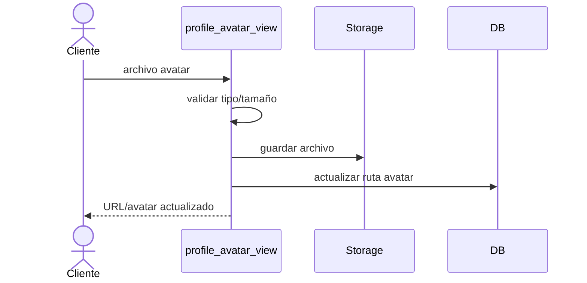

### 8.2 Catálogos y ViewSets base

#### Endpoint: `GET|POST /api/tipos-documento/`
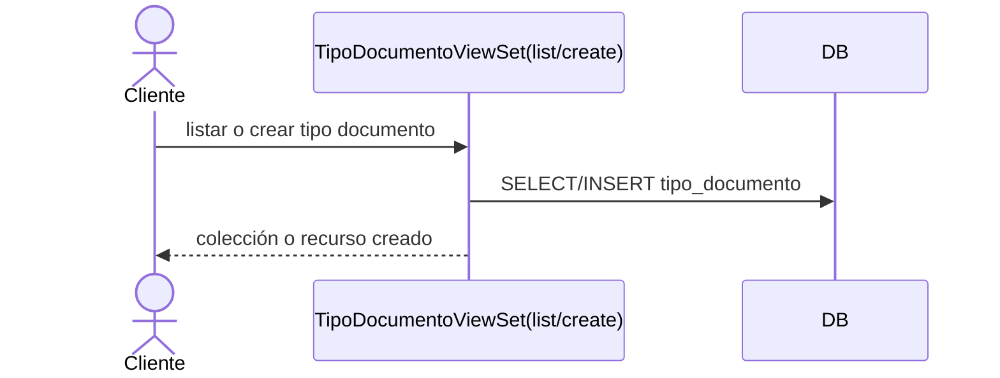

#### Endpoint: `GET|PUT|PATCH|DELETE /api/tipos-documento/{id}/`
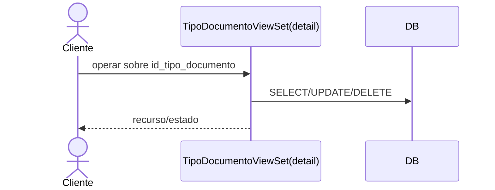

#### Endpoint: `GET /api/tipos-actividad/`
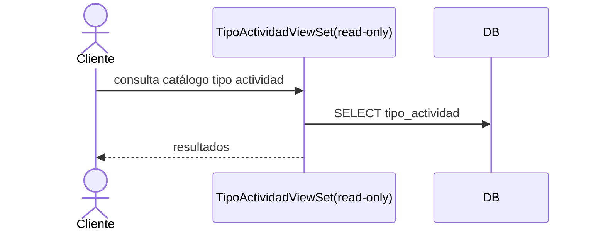

#### Endpoint: `GET /api/tipos-actividad/{id}/`
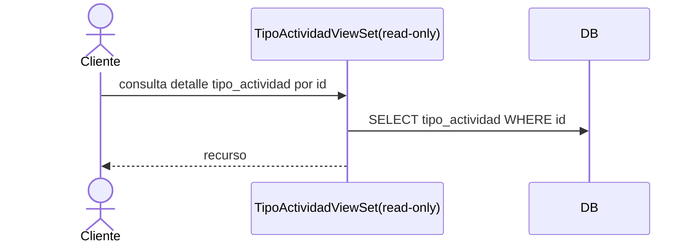

#### Endpoint: `GET /api/programas/`
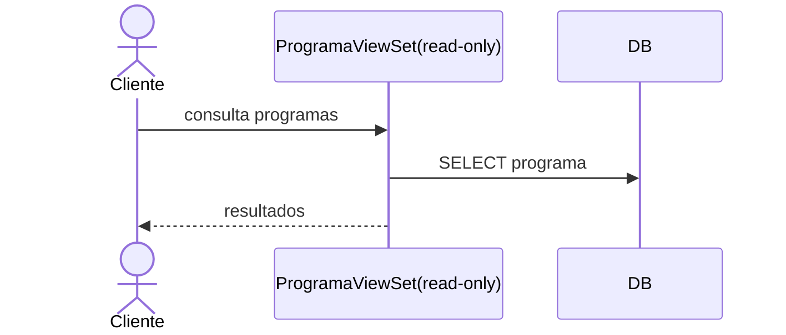

#### Endpoint: `GET /api/programas/{id}/`
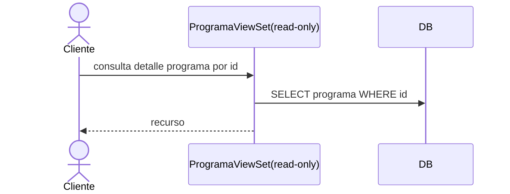

#### Endpoint: `HEAD|OPTIONS /api/docentes/`
```mermaid
sequenceDiagram
    actor Cliente
    participant API as DocenteViewSet
    Cliente->>API: HEAD/OPTIONS
    API-->>Cliente: metadatos de endpoint
```

#### Endpoint: `HEAD|OPTIONS /api/docentes/{id}/`
```mermaid
sequenceDiagram
    actor Cliente
    participant API as DocenteViewSet
    Cliente->>API: HEAD/OPTIONS (detalle)
    API-->>Cliente: metadatos del recurso
```

#### Endpoint: `HEAD|OPTIONS /api/estudiantes/`
```mermaid
sequenceDiagram
    actor Cliente
    participant API as EstudianteViewSet
    Cliente->>API: HEAD/OPTIONS
    API-->>Cliente: metadatos de endpoint
```

#### Endpoint: `HEAD|OPTIONS /api/estudiantes/{id}/`
```mermaid
sequenceDiagram
    actor Cliente
    participant API as EstudianteViewSet
    Cliente->>API: HEAD/OPTIONS (detalle)
    API-->>Cliente: metadatos del recurso
```

#### Endpoint: `GET|POST /api/asignaturas/`
```mermaid
sequenceDiagram
    actor Cliente
    participant API as AsignaturaViewSet(list/create)
    participant DB
    Cliente->>API: listar/crear asignaturas
    API->>DB: consultas con filtros por token/params
    API-->>Cliente: colección o recurso creado
```

#### Endpoint: `GET|PUT|PATCH|DELETE /api/asignaturas/{codigo_asignatura}/`
```mermaid
sequenceDiagram
    actor Cliente
    participant API as AsignaturaViewSet(detail)
    participant DB
    Cliente->>API: operar por código (+grupo/id opcionales)
    API->>DB: resolver objeto por código/grupo/periodo
    API-->>Cliente: recurso o estado
```

### 8.3 Acciones de `AsignaturaViewSet`

#### Endpoint: `GET /api/asignaturas/{codigo}/estudiantes/`
```mermaid
sequenceDiagram
    actor Cliente
    participant API as AsignaturaViewSet.estudiantes
    participant DB
    Cliente->>API: codigo + filtros de periodo
    API->>DB: consultar matrículas y estudiantes
    API-->>Cliente: lista de estudiantes matriculados
```

#### Endpoint: `GET /api/asignaturas/{codigo}/mi-matricula/`
```mermaid
sequenceDiagram
    actor Cliente
    participant API as AsignaturaViewSet.mi_matricula
    participant DB
    Cliente->>API: token estudiante o id_estudiante
    API->>DB: buscar matrícula vigente
    API-->>Cliente: id_matricula|null
```

#### Endpoint: `GET /api/asignaturas/{codigo}/periodos/`
```mermaid
sequenceDiagram
    actor Cliente
    participant API as AsignaturaViewSet.periodos
    participant DB
    Cliente->>API: codigo_asignatura
    API->>DB: periodos distintos con matrícula en asignatura
    API-->>Cliente: periodos disponibles
```

#### Endpoint: `GET /api/asignaturas/{codigo}/ras/`
```mermaid
sequenceDiagram
    actor Cliente
    participant API as AsignaturaViewSet.ras
    participant DB
    Cliente->>API: codigo_asignatura
    API->>DB: SELECT resultado_de_aprendizaje
    API-->>Cliente: RAs con porcentaje
```

#### Endpoint: `GET|POST /api/asignaturas/{codigo}/recursos/`
```mermaid
sequenceDiagram
    actor Cliente
    participant API as AsignaturaViewSet.recursos
    participant FS
    participant DB
    Cliente->>API: listar recursos o subir archivo
    API->>DB: buscar asignatura/recursos
    API->>FS: guardar archivo (POST)
    API->>DB: crear registro recurso (POST)
    API-->>Cliente: lista recursos / recurso creado
```

#### Endpoint: `GET|POST /api/asignaturas/{codigo}/anuncios/`
```mermaid
sequenceDiagram
    actor Cliente
    participant API as AsignaturaViewSet.anuncios
    participant DB
    Cliente->>API: listar o crear anuncio
    API->>API: validar token docente dueño (POST)
    API->>DB: SELECT/INSERT anuncio
    API-->>Cliente: anuncios o anuncio creado
```

### 8.4 RAs, actividades, notas y analítica

#### Endpoint: `GET /api/ras/{ra_id}/indicadores/`
```mermaid
sequenceDiagram
    actor Cliente
    participant API as ra_indicadores_view
    participant DB
    Cliente->>API: ra_id
    API->>DB: listar indicadores del RA
    API-->>Cliente: indicadores
```

#### Endpoint: `POST /api/ras/{ra_id}/indicadores/crear`
```mermaid
sequenceDiagram
    actor Docente
    participant API as docente_crear_indicador_view
    participant DB
    Docente->>API: token + descripcion
    API->>DB: validar RA pertenece a docente
    API->>DB: crear indicador
    API-->>Docente: 201 indicador creado
```

#### Endpoint: `DELETE /api/ras/{ra_id}/indicadores/{ind_id}/`
```mermaid
sequenceDiagram
    actor Docente
    participant API as ra_indicador_detail_view
    participant DB
    Docente->>API: token + ids
    API->>DB: validar pertenencia y existencia
    API->>DB: delete indicador (cascade/set null)
    API-->>Docente: 204
```

#### Endpoint: `PUT /api/ras/{ra_id}/indicadores/{ind_id}/actualizar`
```mermaid
sequenceDiagram
    actor Docente
    participant API as docente_actualizar_indicador_view
    participant DB
    Docente->>API: token + nueva descripcion
    API->>DB: validar docente propietario
    API->>DB: actualizar indicador
    API-->>Docente: indicador actualizado
```

#### Endpoint: `GET|POST /api/ras/{ra_id}/actividades/`
```mermaid
sequenceDiagram
    actor Docente
    participant API as ra_actividades_view
    participant DB
    Docente->>API: listar o crear actividad ligada al RA
    API->>DB: SELECT relaciones / INSERT actividad+ra_actividad
    API-->>Docente: lista o recurso creado
```

#### Endpoint: `PATCH|DELETE /api/ras/{ra_id}/actividades/{rel_id}/`
```mermaid
sequenceDiagram
    actor Docente
    participant API as ra_actividad_detail_view
    participant DB
    Docente->>API: actualizar porcentaje o eliminar relación
    API->>DB: validar ownership docente
    API->>DB: UPDATE/DELETE ra_actividad (+actividad asociada si aplica)
    API-->>Docente: estado final
```

#### Endpoint: `POST /api/actividades/multi`
```mermaid
sequenceDiagram
    actor Docente
    participant API as actividades_multi_view
    participant DB
    Docente->>API: datos actividad + RAs + indicadores
    API->>DB: crear actividad
    API->>DB: crear múltiples relaciones ra_actividad + ra_actividad_indicador
    API-->>Docente: 201 actividad compuesta
```

#### Endpoint: `POST|PUT /api/notas`
```mermaid
sequenceDiagram
    actor Docente
    participant API as notas_view
    participant DB
    Docente->>API: id_matricula + id_ra_actividad + nota
    API->>DB: validar docente autorizado
    API->>DB: upsert nota + recalcular promedios/nota_final
    API-->>Docente: nota registrada/actualizada
```

#### Endpoint: `GET /api/validacion/ra/{ra_id}`
```mermaid
sequenceDiagram
    actor Cliente
    participant API as ra_validation_view
    participant DB
    Cliente->>API: ra_id
    API->>DB: verificar integridad porcentajes del RA
    API-->>Cliente: resultado validación
```

#### Endpoint: `GET /api/validacion/asignatura/{codigo_asignatura}`
```mermaid
sequenceDiagram
    actor Cliente
    participant API as asignatura_validation_view
    participant DB
    Cliente->>API: codigo_asignatura
    API->>DB: validar sumatoria/consistencia de RAs
    API-->>Cliente: diagnóstico de validación
```

#### Endpoint: `GET /api/asignaturas/{codigo}/estudiante/{id}/indicadores`
```mermaid
sequenceDiagram
    actor Cliente
    participant API as course_student_indicators_view
    participant DB
    Cliente->>API: curso + estudiante
    API->>DB: consultar indicadores y notas por RA
    API-->>Cliente: detalle por indicador
```

#### Endpoint: `GET /api/asignaturas/{codigo}/calificaciones/{id}/`
```mermaid
sequenceDiagram
    actor Cliente
    participant API as course_grade_view
    participant DB
    Cliente->>API: curso + estudiante
    API->>DB: consolidar notas por actividades y RAs
    API-->>Cliente: resumen de calificaciones
```

#### Endpoint: `GET /api/asignaturas/{codigo}/detalle/{id}/`
```mermaid
sequenceDiagram
    actor Cliente
    participant API as course_detail_view
    participant DB
    Cliente->>API: curso + estudiante
    API->>DB: cargar actividad, indicador, feedback y progreso
    API-->>Cliente: detalle analítico completo
```

#### Endpoint: `GET /api/asignaturas/{codigo}/analitica/`
```mermaid
sequenceDiagram
    actor Coordinador
    participant API as course_analytics_view
    participant DB
    Coordinador->>API: codigo_asignatura
    API->>DB: agregaciones por RA, estudiantes y notas
    API-->>Coordinador: analítica global de curso
```

#### Endpoint: `GET /api/asignaturas/{codigo}/actividades-agrupadas/`
```mermaid
sequenceDiagram
    actor Cliente
    participant API as course_activities_grouped_view
    participant DB
    Cliente->>API: codigo_asignatura
    API->>DB: agrupar actividades evitando duplicados por RA
    API-->>Cliente: actividades agrupadas
```

#### Endpoint: `GET|POST /api/notificaciones`
```mermaid
sequenceDiagram
    actor Estudiante
    participant API as notifications_view
    participant DB
    Estudiante->>API: listar/crear notificación
    API->>DB: SELECT/INSERT notificacion
    API-->>Estudiante: notificaciones
```

#### Endpoint: `DELETE /api/anuncios/{anuncio_id}/`
```mermaid
sequenceDiagram
    actor Docente
    participant API as anuncio_delete_view
    participant DB
    Docente->>API: token + anuncio_id
    API->>DB: validar dueño del anuncio
    API->>DB: delete anuncio
    API-->>Docente: 204
```

### 8.5 Endpoints de Coordinador

#### Endpoint: `GET|POST /api/coordinador/estudiantes`
```mermaid
sequenceDiagram
    actor Coordinador
    participant API as coordinador_estudiantes_view
    participant DB
    participant MAIL
    Coordinador->>API: listar o crear estudiante
    API->>DB: SELECT/INSERT estudiante
    API->>MAIL: enviar bienvenida (alta individual)
    API-->>Coordinador: listado/creación
```

#### Endpoint: `PATCH /api/coordinador/estudiantes/{id}/desactivar`
```mermaid
sequenceDiagram
    actor Coordinador
    participant API as coordinador_estudiante_desactivar_view
    participant DB
    participant MAIL
    Coordinador->>API: id_estudiante
    API->>DB: marcar activo=false
    API->>MAIL: notificar desactivación
    API-->>Coordinador: estado actualizado
```

#### Endpoint: `PATCH /api/coordinador/estudiantes/{id}/activar`
```mermaid
sequenceDiagram
    actor Coordinador
    participant API as coordinador_estudiante_activar_view
    participant DB
    participant MAIL
    Coordinador->>API: id_estudiante
    API->>DB: marcar activo=true
    API->>MAIL: notificar reactivación
    API-->>Coordinador: estado actualizado
```

#### Endpoint: `PATCH|PUT /api/coordinador/estudiantes/{id}/jornada`
```mermaid
sequenceDiagram
    actor Coordinador
    participant API as coordinador_estudiante_jornada_view
    participant DB
    Coordinador->>API: nueva jornada
    API->>API: normalizar y validar (Diurna/Nocturna)
    API->>DB: actualizar estudiante.jornada
    API-->>Coordinador: estudiante actualizado
```

#### Endpoint: `GET /api/coordinador/periodos`
```mermaid
sequenceDiagram
    actor Coordinador
    participant API as coordinador_periodos_view
    participant DB
    Coordinador->>API: consultar periodos
    API->>DB: SELECT periodo_academico
    API-->>Coordinador: periodos
```

#### Endpoint: `GET /api/coordinador/estudiantes-para-matricula`
```mermaid
sequenceDiagram
    actor Coordinador
    participant API as coordinador_estudiantes_para_matricula_view
    participant DB
    Coordinador->>API: filtros opcionales
    API->>DB: buscar estudiantes aptos para matrícula
    API-->>Coordinador: lista filtrada
```

#### Endpoint: `POST /api/coordinador/matriculas/desmatricular`
```mermaid
sequenceDiagram
    actor Coordinador
    participant API as coordinador_desmatricular_view
    participant DB
    Coordinador->>API: estudiante + asignatura + periodo
    API->>DB: localizar y eliminar matrícula
    API-->>Coordinador: confirmación
```

#### Endpoint: `GET|POST /api/coordinador/docentes`
```mermaid
sequenceDiagram
    actor Coordinador
    participant API as coordinador_docentes_view
    participant DB
    participant MAIL
    Coordinador->>API: listar o crear docente
    API->>DB: SELECT/INSERT docente
    API->>MAIL: bienvenida docente (alta individual)
    API-->>Coordinador: resultado
```

#### Endpoint: `GET /api/coordinador/docentes/{id}/perfil`
```mermaid
sequenceDiagram
    actor Coordinador
    participant API as coordinador_docente_perfil_view
    participant DB
    Coordinador->>API: id_docente
    API->>DB: cargar perfil + asignaturas + métricas
    API-->>Coordinador: perfil docente detallado
```

#### Endpoint: `GET /api/coordinador/estudiantes/{id}/perfil`
```mermaid
sequenceDiagram
    actor Coordinador
    participant API as coordinador_estudiante_perfil_view
    participant DB
    Coordinador->>API: id_estudiante
    API->>DB: historial académico + desempeño
    API-->>Coordinador: perfil estudiante detallado
```

#### Endpoint: `GET /api/coordinador/asignaturas`
```mermaid
sequenceDiagram
    actor Coordinador
    participant API as coordinador_asignaturas_view
    participant DB
    Coordinador->>API: filtros de programa/periodo
    API->>DB: listar asignaturas bajo coordinación
    API-->>Coordinador: asignaturas
```

#### Endpoint: `POST /api/coordinador/asignaturas/crear-ra`
```mermaid
sequenceDiagram
    actor Coordinador
    participant API as coordinador_crear_asignatura_ra_view
    participant DB
    Coordinador->>API: datos asignatura + RAs (+IL opcional)
    API->>DB: crear asignatura
    API->>DB: crear RAs e indicadores asociados
    API-->>Coordinador: creación completa
```

#### Endpoint: `GET /api/coordinador/asignaturas/detalle-edicion`
```mermaid
sequenceDiagram
    actor Coordinador
    participant API as coordinador_asignatura_detalle_edicion_view
    participant DB
    Coordinador->>API: id/codigo de asignatura
    API->>DB: cargar asignatura + RAs + IL
    API-->>Coordinador: estructura editable
```

#### Endpoint: `PATCH /api/coordinador/asignaturas/actualizar-ra`
```mermaid
sequenceDiagram
    actor Coordinador
    participant API as coordinador_actualizar_asignatura_ra_view
    participant DB
    Coordinador->>API: cambios de RAs/porcentajes/IL
    API->>DB: actualizar entidad raíz y relaciones
    API-->>Coordinador: estado actualizado
```

#### Endpoint: `GET /api/coordinador/asignaturas/estudiantes`
```mermaid
sequenceDiagram
    actor Coordinador
    participant API as coordinador_asignatura_estudiantes_view
    participant DB
    Coordinador->>API: asignatura + periodo
    API->>DB: listar estudiantes matriculados
    API-->>Coordinador: estudiantes por asignatura
```

#### Endpoint: `GET /api/coordinador/asignaturas/ras`
```mermaid
sequenceDiagram
    actor Coordinador
    participant API as coordinador_asignatura_ras_view
    participant DB
    Coordinador->>API: asignatura
    API->>DB: listar RAs y pesos
    API-->>Coordinador: malla de RAs
```

#### Endpoint: `GET /api/coordinador/asignaturas/avance`
```mermaid
sequenceDiagram
    actor Coordinador
    participant API as coordinador_asignatura_avance_view
    participant DB
    Coordinador->>API: asignatura + filtros
    API->>DB: agregaciones por RA/actividad/nota
    API-->>Coordinador: avance consolidado
```

#### Endpoint: `POST /api/coordinador/import/matriculados`
```mermaid
sequenceDiagram
    actor Coordinador
    participant API as coordinador_import_matriculados_view
    participant DB
    participant MAIL
    Coordinador->>API: archivo CSV/XLSX
    API->>API: leer y normalizar dataframe
    API->>DB: crear matrículas válidas + auditoría
    API->>MAIL: correos de matrícula en background
    API-->>Coordinador: resumen (creados/existentes/error)
```

#### Endpoint: `POST /api/coordinador/import/docentes`
```mermaid
sequenceDiagram
    actor Coordinador
    participant API as coordinador_import_docentes_view
    participant DB
    participant MAIL
    Coordinador->>API: archivo docentes
    API->>API: validar columnas y registros
    API->>DB: crear docentes + auditoría
    API->>MAIL: enviar bienvenida (async)
    API-->>Coordinador: resumen importación
```

#### Endpoint: `POST /api/coordinador/import/estudiantes`
```mermaid
sequenceDiagram
    actor Coordinador
    participant API as coordinador_import_estudiantes_view
    participant DB
    participant MAIL
    Coordinador->>API: archivo estudiantes
    API->>API: detectar/transformar formato académico
    API->>DB: insertar/omitir + auditoría
    API->>MAIL: bienvenida masiva asíncrona
    API-->>Coordinador: métricas de importación
```

#### Endpoint: `POST /api/coordinador/import/asignaturas-ras`
```mermaid
sequenceDiagram
    actor Coordinador
    participant API as coordinador_import_asignaturas_ras_view
    participant DB
    Coordinador->>API: archivo asignaturas+RAs(+IL)
    API->>API: validar estructura y periodos
    API->>DB: upsert asignaturas/RAs/indicadores
    API-->>Coordinador: resumen de carga
```

#### Endpoint: `GET /api/coordinador/import/templates/{filename}`
```mermaid
sequenceDiagram
    actor Coordinador
    participant API as coordinador_download_template_view
    participant FS
    Coordinador->>API: filename permitido
    API->>API: validar whitelist de plantilla
    API->>FS: abrir archivo en /backend/plantillas
    API-->>Coordinador: FileResponse
```

#### Endpoint: `GET /api/coordinador/dashboard/desempenio/`
```mermaid
sequenceDiagram
    actor Coordinador
    participant API as coordinador_dashboard_desempenio_view
    participant DB
    Coordinador->>API: filtros periodo/asignatura/cohorte
    API->>DB: calcular HU-10 (estudiantes bajo desempeño)
    API->>DB: calcular HU-11 (ranking asignaturas)
    API-->>Coordinador: dashboard analítico + resumen
```

### 8.6 Endpoints de Docente (operaciones de matrícula)

#### Endpoint: `POST /api/docente/asignaturas/{codigo}/import/estudiantes`
```mermaid
sequenceDiagram
    actor Docente
    participant API as docente_import_estudiantes_view
    participant DB
    Docente->>API: token + archivo estudiantes
    API->>DB: validar asignatura propiedad del docente
    API->>DB: crear matrículas válidas
    API-->>Docente: resumen importación del curso
```

#### Endpoint: `GET /api/docente/buscar-estudiante`
```mermaid
sequenceDiagram
    actor Docente
    participant API as docente_buscar_estudiante_view
    participant DB
    Docente->>API: código estudiante
    API->>DB: buscar estudiante candidato
    API-->>Docente: datos del estudiante/no encontrado
```

#### Endpoint: `POST /api/docente/asignaturas/{codigo}/estudiantes`
```mermaid
sequenceDiagram
    actor Docente
    participant API as docente_agregar_estudiante_view
    participant DB
    Docente->>API: código estudiante
    API->>DB: validar docente-asignatura + existencia estudiante
    API->>DB: crear matrícula individual
    API-->>Docente: matrícula creada/duplicada
```

### 8.7 Endpoints de documentación OpenAPI

#### Endpoint: `GET /api/schema/`
```mermaid
sequenceDiagram
    actor Cliente
    participant API as SpectacularAPIView
    Cliente->>API: solicitar schema OpenAPI
    API-->>Cliente: JSON/YAML del esquema
```

#### Endpoint: `GET /api/docs/`
```mermaid
sequenceDiagram
    actor Cliente
    participant API as SpectacularSwaggerView
    Cliente->>API: abrir Swagger UI
    API-->>Cliente: HTML + assets de documentación interactiva
```

#### Endpoint: `GET /api/redoc/`
```mermaid
sequenceDiagram
    actor Cliente
    participant API as SpectacularRedocView
    Cliente->>API: abrir ReDoc
    API-->>Cliente: HTML + assets de documentación técnica
```

---

## 9) Notas de análisis técnico

- La API combina **ViewSets DRF** (catálogos y asignaturas) con **function-based views** para flujos de negocio complejos.
- El control de acceso se basa en **token firmado (`django.core.signing`)** y validaciones por rol/propiedad de recurso.
- Los procesos de importación usan `pandas` con normalización de columnas y auditoría (`ImportAudit`).
- El cálculo académico (RA/actividad/nota final) está centralizado en endpoints de notas, analítica y dashboard de desempeño.
