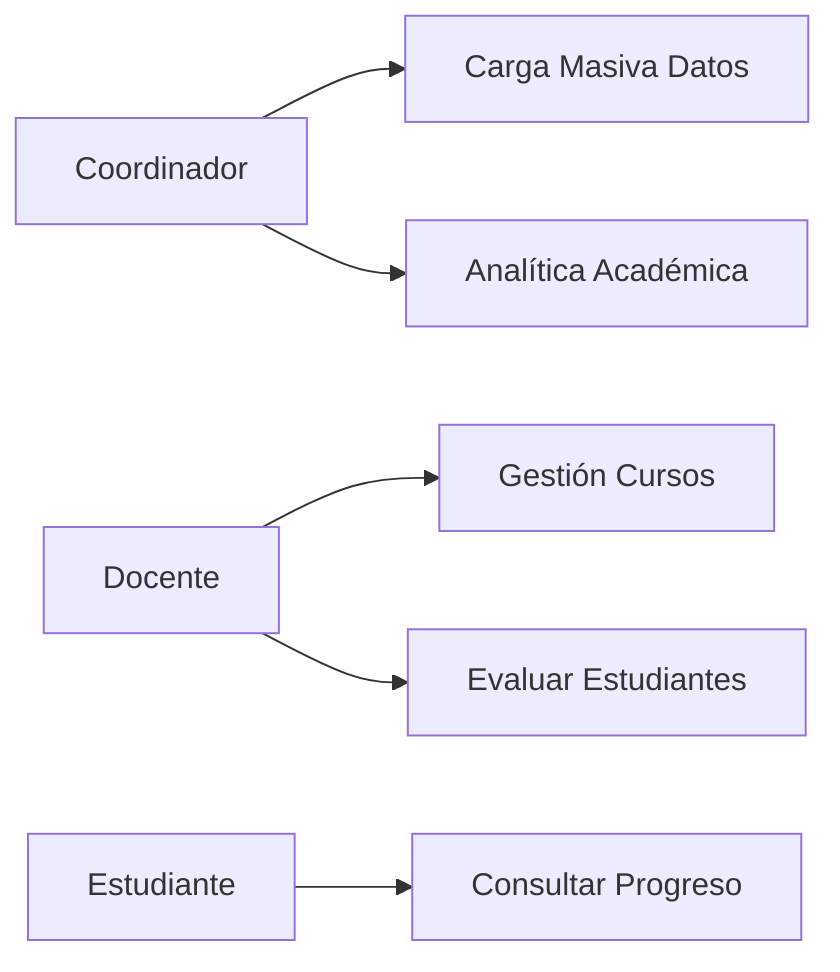
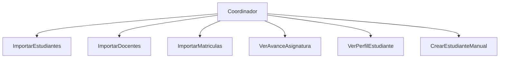
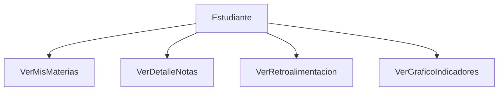

# Documentación funcional del sistema (generada desde el código)

## 1. Resumen del sistema
El sistema es una plataforma de gestión académica enfocada en Resultados de Aprendizaje (RAs). Permite la administración de asignaturas, matrículas y calificaciones bajó un modelo de competencias.

El sistema está construido con una arquitectura desacoplada:
*   **Backend**: Django (Python) expone una API REST.
*   **Frontend**: React (TypeScript) consume la API.

El núcleo del negocio gira en torno a la evaluación de **RAs** (Resultados de Aprendizaje) mediante **Actividades**. Las notas no son solo un número final, sino que se derivan del cumplimiento ponderado de RAs a través de diferentes actividades.

---

## 2. Arquitectura del sistema

### Tecnologías detectadas
*   **Lenguaje Backend**: Python (Django 5.2.6)
*   **API Framework**: Django Rest Framework (DRF)
*   **Base de Datos**: PostgreSQL (inferido por `django.db.backends.postgresql` en settings)
*   **Frontend**: React + Vite + TypeScript
*   **Estilos**: CSS Modules / Librerías estándar (Bootstrap inferido por clases en código leído)
*   **Autenticación**: Token-based (Custom signing) + OTP para recuperación.

### Estructura Backend
El backend sigue el patrón MVT de Django pero adaptado a API REST:
*   `api/models`: Definición de esquema de datos (ORM).
*   `api/views`: Lógica de negocio dividida en ViewSets y funciones (`@api_view`).
*   `api/urls`: Enrutamiento de endpoints.
*   `api/serializers`: Transformación de datos Model <-> JSON.

### Estructura Frontend
Aplicación SPA (Single Page Application):
*   `src/pages`: Vistas principales separadas por rol (`docente`, `estudiante`, `coordinador`).
*   `src/services`: Capa de abstracción para consumo de API (`api.ts`, `coordinador.ts`).
*   `src/connections`: Configuración de Axios e interceptores.

---

## 3. Backend

### Endpoints detectados

| Endpoint | Método | Descripción | Roles permitidos |
|--------|--------|--------|--------|
| `/api/auth/login` | POST | Inicio de sesión (con rate limiting) | Público |
| `/api/auth/me` | GET | Obtener usuario actual | Autenticado |
| `/api/auth/password/forgot` | POST | Solicitar OTP de recuperación | Público |
| `/api/coordinador/estudiantes` | GET/POST | Listar o crear estudiantes | Coordinador |
| `/api/coordinador/import/estudiantes` | POST | Carga masiva (CSV/Excel) de estudiantes | Coordinador |
| `/api/coordinador/import/docentes` | POST | Carga masiva de docentes | Coordinador |
| `/api/coordinador/import/matriculados` | POST | Matricular estudiantes masivamente | Coordinador |
| `/api/coordinador/asignaturas/avance` | GET | Analítica de curso y RAs | Coordinador |
| `/api/coordinador/estudiantes/{id}/perfil`| GET | Historial académico completo | Coordinador |
| `/api/docentes/` | CRUD | Gestión de docentes (ViewSet) | Admin/Coord |
| `/api/asignaturas/` | CRUD | Gestión de asignaturas (ViewSet) | Admin/Coord |
| `/api/ras/{id}/actividades/` | GET/POST | Gestión de actividades de un RA | Docente |
| `/api/notas` | POST | Registrar/Actualizar calificación | Docente |
| `/api/docente/asignaturas/{cod}/estudiantes`| POST | Agregar estudiante a curso | Docente |
| `/api/asignaturas/{cod}/detalle/{id}/` | GET | Vista detallada de notas para estudiante | Estudiante |

*Nota: La lista no es exhaustiva, muestra los endpoints core identificados.*

---

## 4. Frontend

### Vistas detectadas

| Vista | Ruta | Rol que puede acceder | Acciones disponibles |
|------|------|------|------|
| Login | `/login` | Publico | Iniciar sesión, ir a "olvidé contraseña" |
| Dashboard Coordinador | `/coordinador` | Coordinador | Ver métricas generales |
| Gestión Materias | `/coordinador/materias` | Coordinador | Listar materias, ver analíticas |
| Analítica Asignatura | `/coordinador/materias/:codigo/analitica`| Coordinador | Ver progreso por RA, cobertura del curso |
| Cursos Docente | `/docente` | Docente | Ver sus asignaturas asignadas |
| RAs del Curso | `/docente/:curso/ras` | Docente | Ver RAs, gestionar actividades |
| Calificar | `/docente/:curso/calificar` | Docente | Asignar notas a estudiantes |
| Estudiante Dashboard | `/estudiante` | Estudiante | Ver materias matriculadas |
| Detalle Materia | `/estudiante/materias/:codigo/detalle` | Estudiante | Ver sus notas, feedback y progreso |

---

# 5. Casos de uso del sistema

## Diagrama general de casos de uso



## Casos de uso por rol

### Coordinador



### Docente

```mermaid
flowchart TD
    Docente --> VerMisCursos
    Docente --> CrearActividad
    Docente --> AsociarActividadRA[Asociar Actividad a RA]
    Docente --> RegistrarNotas
    Docente --> ImportarEstudiantesCurso[Importar Estudiantes (Su curso)]
    Docente --> AgregarEstudiante[Agregar Estudiante Individual]
```

### Estudiante



---

## 6. Mapa Frontend → Backend

| Vista Frontend (Componente) | Servicio / Función | Endpoint consumido | Método |
|---------------------------|-------------------|-------------------|--------|
| `CoordinadorImports` | `importEstudiantes` | `/api/coordinador/import/estudiantes` | POST |
| `CoordinadorAsignaturaAnalisis` | `fetchAsignaturaAvance` | `/api/coordinador/asignaturas/avance` | GET |
| `DocenteRAs` | `getRAsByCourse` | `/api/asignaturas/{id}/ras/` | GET |
| `NuevaActividadCurso` | `createActivityMulti` | `/api/actividades/multi` | POST |
| `DocenteCalificar` | `upsertGrade` | `/api/notas` | POST |
| `EstudianteMateriaDetalle` | `getCourseDetail` | `/api/asignaturas/{cod}/detalle/{id}/` | GET |

---

## 7. Funcionalidades incompletas detectadas

1.  **Eliminación de usuarios**: No se detectaron endpoints explícitos para eliminar Docentes o Estudiantes ("Archive/Soft Delete" no visible en Vistas principales).
2.  **Edición de Perfil**: El endpoint `/auth/profile` permite GET y PUT, pero en el frontend solo se detectó uso claro de visualización o cambio de avatar.
3.  **Notificaciones**: Existe el modelo `Notificacion` y el endpoint `/notificaciones`, pero su uso en el frontend parece limitado a lectura (no hay lógica compleja de marcado como leído en los fragmentos analizados).

---

## 8. Funcionalidades inexistentes (No halladas en código)

1.  **Chat en tiempo real**: No hay websockets ni endpoints de mensajería instantánea.
2.  **Foros de discusión**: No existen modelos ni vistas para foros.
3.  **Entrega de tareas (Archivos)**: El modelo `Actividad` define fechas y tipos, pero no hay un campo `FileField` para subir tareas, ni endpoints para recepción de archivos de estudiantes. Es un sistema de **registro de notas**, no un LMS completo (Moodle-like).
4.  **Asistencia**: No hay modelos ni endpoints para control de asistencia.
