# RA Manager – Arquitectura del Sistema

**Versión:** 1.0  
**Fecha:** 4 de marzo de 2026  
**Elaborado por:** Análisis de Ingeniería Inversa del Código Fuente

---

## 1. Descripción General del Sistema

### 1.1 Propósito

RA-Manager es un sistema integral de gestión de Resultados de Aprendizaje (RAs) diseñado para instituciones educativas. El sistema permite la administración completa del ciclo de vida académico desde la perspectiva de coordinadores, docentes y estudiantes.

### 1.2 Problema que Resuelve

- Gestión descentralizada de asignaturas, actividades y calificaciones
- Seguimiento en tiempo real del progreso de Resultados de Aprendizaje
- Falta de visibilidad del desempeño estudiantil por indicadores de logro
- Dificultad en la importación masiva de datos académicos
- Ausencia de analíticas detalladas del rendimiento académico

### 1.3 Tecnologías Utilizadas

#### Backend

- **Framework:** Django 5.2.6
- **API:** Django REST Framework 3.16.1
- **Base de Datos:** PostgreSQL (configurado para producción)
- **Lenguaje:** Python 3.x
- **Documentación API:** drf-spectacular (OpenAPI/Swagger)

#### Frontend

- **Framework:** React 19.1.1
- **Lenguaje:** TypeScript 5.8.3
- **Routing:** React Router DOM 6.26.2
- **Build Tool:** Vite 5.4.10
- **UI Framework:** Bootstrap 5.3.3
- **Gráficas:** Chart.js 4.5.0
- **HTTP Client:** Axios 1.12.2
- **Alertas:** SweetAlert2 11.26.20

#### Seguridad

- **CORS:** django-cors-headers 4.0.0
- **Rate Limiting:** django-ratelimit 4.0.0
- **Hashing de Contraseñas:** Django's contrib.auth (PBKDF2/Bcrypt)

#### Procesamiento de Datos

- **Pandas:** 2.0.0+ (procesamiento de CSV/Excel)
- **OpenPyXL:** 3.1.0+ (lectura/escritura Excel)

#### Configuración

- **Variables de Entorno:** python-dotenv 1.0.0
- **Zona Horaria:** America/Bogota
- **Idioma:** es-co (Español - Colombia)

---

## 2. Arquitectura del Sistema

### 2.1 Diagrama de Arquitectura General

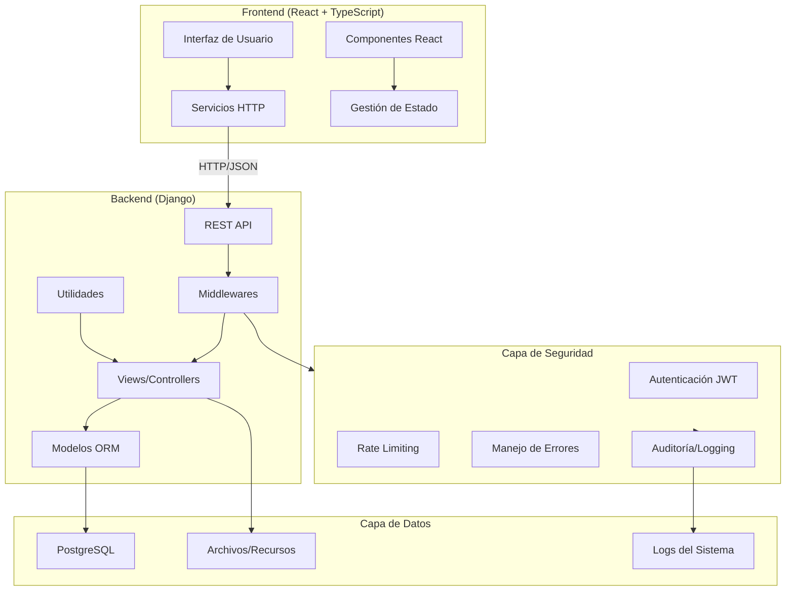

### 2.2 Patrón Arquitectónico

El sistema implementa una arquitectura **Cliente-Servidor con separación completa Frontend-Backend**:

- **Frontend SPA (Single Page Application):** React con TypeScript para UI dinámica
- **Backend API REST:** Django REST Framework con endpoints RESTful
- **ORM:** Django ORM para abstracción de base de datos
- **Middleware Pipeline:** Capas de seguridad, logging y manejo de errores

---

## 3. Estructura del Proyecto

### 3.1 Organización de Carpetas

```
RA-Manager/
│
├── backend/                    # Aplicación Django (API Backend)
│   ├── api/                    # App principal de Django
│   │   ├── models/             # Modelos de base de datos
│   │   │   └── models.py       # Definición de todas las entidades
│   │   ├── views/              # Controladores de la API
│   │   │   ├── views.py        # Todas las vistas y ViewSets
│   │   │   └── utils.py        # Utilidades de vistas
│   │   ├── serializers/        # Serializadores DRF
│   │   │   └── serializers.py  # Conversión modelo ↔ JSON
│   │   ├── urls/               # Rutas de la API
│   │   │   └── urls.py         # Definición de endpoints
│   │   ├── middleware/         # Middlewares personalizados
│   │   │   ├── error_handler.py # Manejo centralizado de errores
│   │   │   └── ratelimit.py    # Auditoría de rate limiting
│   │   ├── utils/              # Utilidades generales
│   │   │   └── security.py     # Funciones de seguridad
│   │   ├── migrations/         # Migraciones de base de datos
│   │   └── management/         # Comandos personalizados de Django
│   ├── backend/                # Configuración del proyecto Django
│   │   ├── settings.py         # Configuración principal
│   │   ├── urls.py             # Rutas raíz
│   │   └── wsgi.py             # Punto de entrada WSGI
│   ├── db/                     # Scripts de base de datos
│   ├── logs/                   # Archivos de log
│   ├── media/                  # Archivos subidos (avatares, recursos)
│   ├── plantillas/             # Plantillas CSV de importación
│   ├── manage.py               # CLI de Django
│   └── requirements.txt        # Dependencias Python
│
├── frontend/                   # Aplicación React (SPA)
│   ├── src/
│   │   ├── pages/              # Páginas principales por rol
│   │   │   ├── coordinador/    # Vistas del coordinador
│   │   │   │   ├── Dashboard.tsx
│   │   │   │   ├── Estudiantes.tsx
│   │   │   │   ├── Materias.tsx
│   │   │   │   ├── Asignatura.tsx
│   │   │   │   ├── AsignaturaAnalisis.tsx
│   │   │   │   └── Imports.tsx
│   │   │   ├── docente/        # Vistas del docente
│   │   │   │   ├── Cursos.tsx
│   │   │   │   ├── RAs.tsx
│   │   │   │   ├── Calificar.tsx
│   │   │   │   ├── CrearActividad.tsx
│   │   │   │   ├── NuevaActividad.tsx
│   │   │   │   └── Recursos.tsx
│   │   │   ├── estudiante/     # Vistas del estudiante
│   │   │   │   └── MateriaDetalle.tsx
│   │   │   ├── Login.tsx
│   │   │   ├── Recuperar.tsx
│   │   │   ├── Reset.tsx
│   │   │   └── Profile.tsx
│   │   ├── components/         # Componentes reutilizables
│   │   │   ├── HeaderBar.tsx
│   │   │   ├── Sidebar.tsx
│   │   │   ├── Alert.tsx
│   │   │   ├── Toast.tsx
│   │   │   ├── Spinner.tsx
│   │   │   ├── NotificationsBell.tsx
│   │   │   ├── ActivityDetailsModal.tsx
│   │   │   ├── ProgressModal.tsx
│   │   │   ├── RaCard.tsx
│   │   │   ├── GradeSummary.tsx
│   │   │   └── [otros componentes]
│   │   ├── services/           # Lógica de negocio
│   │   │   ├── auth.ts         # Servicios de autenticación
│   │   │   ├── api.ts          # Servicios generales de API
│   │   │   ├── coordinador.ts  # Servicios del coordinador
│   │   │   └── index.ts
│   │   ├── connections/        # Configuración HTTP
│   │   │   ├── http.ts         # Cliente Axios configurado
│   │   │   └── endpoints.ts    # Definición de endpoints
│   │   ├── state/              # Gestión de estado global
│   │   ├── hooks/              # Custom React Hooks
│   │   ├── utils/              # Utilidades del frontend
│   │   ├── types.ts            # Tipos TypeScript
│   │   ├── App.tsx             # Componente raíz
│   │   └── main.tsx            # Punto de entrada
│   ├── public/                 # Archivos estáticos
│   ├── package.json            # Dependencias Node.js
│   └── vite.config.ts          # Configuración de Vite
│
├── env/                        # Entorno virtual Python
├── .env                        # Variables de entorno (no versionado)
├── README.md                   # Documentación principal
└── CHANGELOG.md                # Registro de cambios
```

### 3.2 Propósito de Cada Módulo

#### Backend

- **models/:** Define la estructura de la base de datos y relaciones entre entidades
- **views/:** Implementa la lógica de negocio y controladores de endpoints
- **serializers/:** Convierte objetos Python ↔ JSON para la API
- **urls/:** Mapea URLs a vistas/controladores
- **middleware/:** Procesa requests antes de llegar a las vistas (seguridad, logging)
- **utils/:** Funciones auxiliares reutilizables (seguridad, validaciones)

#### Frontend

- **pages/:** Páginas completas organizadas por rol de usuario
- **components/:** Componentes React reutilizables (UI)
- **services/:** Capa de abstracción para llamadas HTTP
- **connections/:** Configuración de cliente HTTP y endpoints
- **state/:** Gestión centralizada del estado de la aplicación
- **hooks/:** Lógica reutilizable de React
- **utils/:** Funciones auxiliares del frontend

---

## 4. Modelos de Datos (Base de Datos)

### 4.1 Entidades Principales

#### 4.1.1 Usuarios

**Estudiante**
- **Tabla:** `estudiante`
- **Campos:**
  - `id_estudiante` (PK, BigAutoField)
  - `nombre` (CharField, max 100)
  - `apellido` (CharField, max 100)
  - `codigo_estudiante` (CharField, max 50, único)
  - `contrasena_estudiante` (CharField, max 255, hasheada)
  - `correo` (EmailField, único)
  - `tipo_documento` (FK → TipoDocumento)
  - `num_documento` (CharField, max 50, único)
  - `jornada` (CharField, max 50, opcional)
- **Relaciones:**
  - FK → TipoDocumento
  - 1:N → Matricula
  - 1:N → Notificacion

**Docente**
- **Tabla:** `docente`
- **Campos:**
  - `id_docente` (PK, BigAutoField)
  - `nombre` (CharField, max 100)
  - `apellido` (CharField, max 100)
  - `codigo_docente` (CharField, max 50, único)
  - `contrasenia_docente` (CharField, max 255, hasheada)
  - `correo` (EmailField, único)
  - `tipo_documento` (FK → TipoDocumento)
  - `num_documento` (CharField, max 50, único)
  - `num_telefono` (CharField, max 30, opcional)
- **Relaciones:**
  - FK → TipoDocumento
  - 1:N → Asignatura
  - 1:N → Anuncio

**Coordinador**
- **Tabla:** `coordinador`
- **Campos:**
  - `id_coordinador` (PK, BigAutoField)
  - `nombre` (CharField, max 100)
  - `codigo_coordinador` (CharField, max 50, único)
  - `contrasenia_coord` (CharField, max 255, hasheada)
  - `correo` (EmailField, único)
- **Relaciones:**
  - 1:N → ImportAudit

#### 4.1.2 Catálogos

**TipoDocumento**
- **Tabla:** `tipo_documento`
- **Campos:**
  - `id_tipo_documento` (PK)
  - `descripcion` (CharField, max 100, único)
- **Ejemplos:** Cédula, Pasaporte, TI

**TipoActividad**
- **Tabla:** `tipo_actividad`
- **Campos:**
  - `id_tipo_actividad` (PK)
  - `descripcion` (CharField, max 100, único)
- **Ejemplos:** Quiz, Taller, Examen, Proyecto

**Programa**
- **Tabla:** `programa`
- **Campos:**
  - `id_programa` (PK)
  - `nombre` (CharField, max 150)
  - `codigo_programa` (CharField, max 50, único)
- **Ejemplos:** Ingeniería de Sistemas, Medicina

**PeriodoAcademico**
- **Tabla:** `periodo_academico`
- **Campos:**
  - `id_periodo` (PK)
  - `descripcion` (CharField, max 100, único)
  - `fecha_inicio` (DateField)
  - `fecha_finalizacion` (DateField)
- **Constraint:** `fecha_finalizacion >= fecha_inicio`

#### 4.1.3 Académico

**Asignatura**
- **Tabla:** `asignatura`
- **Campos:**
  - `id_asignatura` (PK)
  - `nombre` (CharField, max 150)
  - `codigo_asignatura` (CharField, max 50, único)
  - `docente` (FK → Docente)
  - `grupo` (CharField, max 20, opcional)
  - `programa` (FK → Programa)
- **Relaciones:**
  - FK → Docente, Programa
  - 1:N → ResultadoDeAprendizaje
  - 1:N → Matricula
  - 1:N → Recurso
  - 1:N → Anuncio

**ResultadoDeAprendizaje (RA)**
- **Tabla:** `resultado_de_aprendizaje`
- **Campos:**
  - `id_ra` (PK)
  - `asignatura` (FK → Asignatura, CASCADE)
  - `porcentaje_ra` (Decimal 5,2 entre 0-100)
  - `descripcion` (TextField, opcional)
- **Relaciones:**
  - FK → Asignatura
  - 1:N → IndicadoresDeLogro
  - N:M → Actividad (a través de RaActividad)
- **Constraint:** La suma de `porcentaje_ra` de todos los RAs de una asignatura debe ser 100

**IndicadoresDeLogro**
- **Tabla:** `indicadores_de_logro`
- **Campos:**
  - `id_ind` (PK)
  - `ra` (FK → ResultadoDeAprendizaje, CASCADE)
  - `porcentaje_ind` (Decimal 5,2 entre 0-100)
  - `descripcion` (TextField, opcional)
- **Relaciones:**
  - FK → ResultadoDeAprendizaje
  - N:M → RaActividad (a través de RaActividadIndicador)
  - 1:N → NotasActividad
- **Constraint:** La suma de `porcentaje_ind` de todos los indicadores de un RA debe ser 100

**Actividad**
- **Tabla:** `actividad`
- **Campos:**
  - `id_actividad` (PK)
  - `tipo_actividad` (FK → TipoActividad)
  - `nombre_actividad` (CharField, max 150)
  - `descripcion` (TextField, opcional)
  - `fecha_creacion` (DateField)
  - `fecha_cierre` (DateField, opcional)
- **Relaciones:**
  - FK → TipoActividad
  - N:M → ResultadoDeAprendizaje (a través de RaActividad)
- **Constraint:** `fecha_cierre >= fecha_creacion` si existe

**RaActividad**
- **Tabla:** `ra_actividad`
- **Campos:**
  - `id_ra_actividad` (PK)
  - `actividad` (FK → Actividad, CASCADE)
  - `ra` (FK → ResultadoDeAprendizaje, CASCADE)
  - `porcentaje_ra_actividad` (Decimal 5,2 entre 0-100)
- **Relaciones:**
  - FK → Actividad, ResultadoDeAprendizaje
  - N:M → IndicadoresDeLogro (a través de RaActividadIndicador)
  - 1:N → NotasActividad
- **Constraint:** 
  - Combinación (actividad, ra) única
  - La suma de `porcentaje_ra_actividad` de todas las actividades de un RA debe ser 100

**RaActividadIndicador**
- **Tabla:** `ra_actividad_indicador`
- **Campos:**
  - `id` (PK)
  - `ra_actividad` (FK → RaActividad, CASCADE)
  - `indicador` (FK → IndicadoresDeLogro, CASCADE)
- **Propósito:** Permite asociar una actividad a múltiples indicadores de logro del mismo RA
- **Constraint:** Combinación (ra_actividad, indicador) única

#### 4.1.4 Calificaciones

**Matricula**
- **Tabla:** `matricula`
- **Campos:**
  - `id_matricula` (PK)
  - `estudiante` (FK → Estudiante, CASCADE)
  - `periodo` (FK → PeriodoAcademico)
  - `asignatura` (FK → Asignatura)
  - `nota_final` (Decimal 5,2 entre 0-5, opcional)
- **Relaciones:**
  - FK → Estudiante, PeriodoAcademico, Asignatura
  - 1:N → NotasActividad
- **Constraint:** Combinación (estudiante, periodo, asignatura) única

**NotasActividad**
- **Tabla:** `notas_actividad`
- **Campos:**
  - `id` (PK, BigAutoField)
  - `matricula` (FK → Matricula, CASCADE)
  - `ra_actividad` (FK → RaActividad, CASCADE)
  - `nota_ra_actividad` (Decimal 5,2 entre 0-5, opcional)
  - `retroalimentacion` (TextField, opcional)
  - `indicador` (FK → IndicadoresDeLogro, SET_NULL, opcional)
- **Relaciones:**
  - FK → Matricula, RaActividad, IndicadoresDeLogro
- **Constraint:** Combinación (matricula, ra_actividad, indicador) única
- **Lógica:** Permite calificaciones diferenciadas por indicador de logro en una misma actividad

#### 4.1.5 Recursos y Comunicación

**Recurso**
- **Tabla:** `recurso`
- **Campos:**
  - `id_recurso` (PK)
  - `asignatura` (FK → Asignatura, CASCADE)
  - `titulo` (CharField, max 200)
  - `archivo` (FileField, upload_to="recursos/%Y/%m/%d")
  - `fecha_subida` (DateTimeField, auto_now_add)
- **Relaciones:**
  - FK → Asignatura
- **Formatos Soportados:** PDF, imágenes, videos

**Anuncio**
- **Tabla:** `anuncio`
- **Campos:**
  - `id` (PK)
  - `asignatura` (FK → Asignatura, CASCADE)
  - `docente` (FK → Docente, CASCADE)
  - `titulo` (CharField, max 200)
  - `contenido` (TextField)
  - `fecha_publicacion` (DateTimeField, auto_now_add)
  - `es_importante` (BooleanField, default False)
- **Relaciones:**
  - FK → Asignatura, Docente
- **Propósito:** Comunicación docente → estudiantes de una asignatura

**Notificacion**
- **Tabla:** `notificacion`
- **Campos:**
  - `id` (PK, UUID)
  - `estudiante` (FK → Estudiante, CASCADE)
  - `tipo` (CharField, choices: grade, resource, deadline, message, announcement)
  - `texto` (TextField)
  - `enlace` (CharField, max 500, opcional)
  - `leida` (BooleanField, default False)
  - `fecha_creacion` (DateTimeField, auto_now_add)
  - `fecha_lectura` (DateTimeField, opcional)
- **Relaciones:**
  - FK → Estudiante
- **Propósito:** Sistema de notificaciones persistentes para estudiantes

#### 4.1.6 Seguridad y Auditoría

**PasswordResetOTP**
- **Tabla:** `password_reset_otp`
- **Campos:**
  - `id` (PK)
  - `email` (EmailField, index)
  - `otp_code` (CharField, max 6)
  - `created_at` (DateTimeField, auto_now_add)
  - `expires_at` (DateTimeField)
  - `is_used` (BooleanField, default False)
  - `rol` (CharField, max 20: 'estudiante' o 'docente')
- **Propósito:** Códigos OTP de 6 dígitos para recuperación de contraseña

**LoginAttempt**
- **Tabla:** `login_attempt`
- **Campos:**
  - `id` (PK)
  - `usuario_codigo` (CharField, max 100, index)
  - `usuario_email` (EmailField, opcional)
  - `rol_intentado` (CharField, max 20, opcional)
  - `exito` (BooleanField, default False)
  - `motivo_fallo` (CharField, max 200, opcional)
  - `ip_address` (GenericIPAddressField)
  - `user_agent` (TextField, opcional)
  - `timestamp` (DateTimeField, auto_now_add, index)
- **Propósito:** Auditoría de todos los intentos de login (exitosos y fallidos)

**AccountLockout**
- **Tabla:** `account_lockout`
- **Campos:**
  - `id` (PK)
  - `usuario_codigo` (CharField, max 100, único, index)
  - `intentos_fallidos` (IntegerField, default 0)
  - `bloqueado` (BooleanField, default False, index)
  - `fecha_bloqueo` (DateTimeField, opcional)
  - `fecha_desbloqueo` (DateTimeField, opcional)
  - `ultimo_intento_fallido` (DateTimeField, opcional)
  - `ultimo_intento_ip` (GenericIPAddressField, opcional)
  - `notificacion_enviada` (BooleanField, default False)
  - `created_at` (DateTimeField, auto_now_add)
  - `updated_at` (DateTimeField, auto_now)
- **Propósito:** Protección contra ataques de fuerza bruta
- **Lógica:** 
  - Bloqueo automático tras 3 intentos fallidos
  - Duración de bloqueo: 30 minutos
  - Desbloqueo automático tras expiración

**SecurityEvent**
- **Tabla:** `security_event`
- **Campos:**
  - `id` (PK)
  - `evento` (CharField, max 50, choices, index)
  - `usuario_codigo` (CharField, max 100, opcional, index)
  - `ip_address` (GenericIPAddressField, opcional)
  - `detalles` (TextField, opcional, formato JSON)
  - `timestamp` (DateTimeField, auto_now_add, index)
- **Eventos Soportados:**
  - LOGIN_SUCCESS, LOGIN_FAILED
  - ACCOUNT_LOCKED, ACCOUNT_UNLOCKED
  - PASSWORD_RESET_REQUEST, PASSWORD_RESET_SUCCESS
  - OTP_GENERATED, OTP_VERIFIED, OTP_FAILED
  - SUSPICIOUS_ACTIVITY, RATE_LIMIT_EXCEEDED
- **Propósito:** Bitácora de eventos de seguridad para análisis y auditoría

**ImportAudit**
- **Tabla:** `import_audit`
- **Campos:**
  - `id` (PK)
  - `coordinador` (FK → Coordinador, SET_NULL, opcional)
  - `kind` (CharField, max 32, choices: matriculados, estudiantes, docentes, asignaturas_ras)
  - `filename` (CharField, max 255, opcional)
  - `created_count` (IntegerField, default 0)
  - `existing_count` (IntegerField, default 0)
  - `errors_count` (IntegerField, default 0)
  - `created_at` (DateTimeField, auto_now_add)
- **Propósito:** Trazabilidad de importaciones masivas realizadas por coordinadores

---

### 4.2 Diagrama Entidad-Relación (ER)

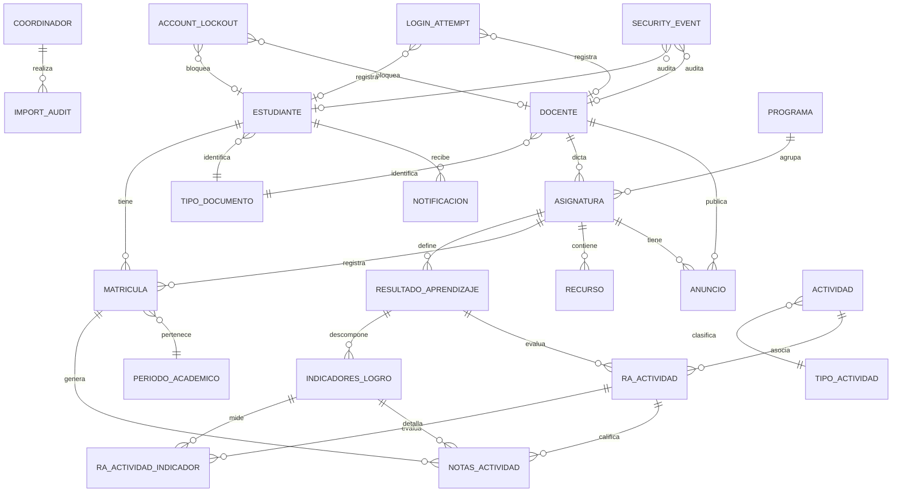

---

### 4.3 Relaciones Clave

1. **Estudiante - Matricula - Asignatura:** Un estudiante puede estar matriculado en múltiples asignaturas en diferentes periodos
2. **Asignatura - RA - Indicadores:** Cada asignatura define RAs, cada RA se descompone en indicadores
3. **Actividad - RA (N:M):** Una actividad puede evaluar múltiples RAs (actividad integradora)
4. **RaActividad - Indicadores (N:M):** Una actividad puede calificar múltiples indicadores del mismo RA
5. **NotasActividad:** Almacena calificación por estudiante, por actividad, opcionalmente por indicador específico

---

### 4.4 Constraints y Validaciones

Detectados en el código:

1. **Porcentajes:**
   - RAs de una asignatura suman 100%
   - Indicadores de un RA suman 100%
   - Actividades de un RA suman 100%
   
2. **Notas:**
   - Escala 0-5 (sistema colombiano)
   - Nota final opcional hasta completar el curso
   
3. **Fechas:**
   - `fecha_cierre >= fecha_creacion` en Actividad
   - `fecha_finalizacion >= fecha_inicio` en PeriodoAcademico
   
4. **Unicidad:**
   - Combinación (estudiante, periodo, asignatura) única en Matricula
   - Combinación (matricula, ra_actividad, indicador) única en NotasActividad
   - Combinación (actividad, ra) única en RaActividad
   - Combinación (ra_actividad, indicador) única en RaActividadIndicador

---

## 5. Roles del Sistema

### 5.1 Coordinador

#### Permisos

- Acceso completo a todos los datos del sistema (vista de solo lectura en cursos)
- Gestión de docentes y estudiantes (crear, editar, eliminar)
- Importación masiva de datos (CSV/Excel)
- Asignación de docentes a asignaturas
- Vista de rendimiento global por asignatura y estudiante

#### Funcionalidades

1. **Dashboard Global:**
   - Métricas de todas las asignaturas
   - Visualización de avance de RAs por asignatura
   - Estadísticas por periodo académico

2. **Gestión de Estudiantes:**
   - Listar todos los estudiantes
   - Crear estudiante individual (genera contraseña automáticamente)
   - Importación masiva desde CSV
   - Ver perfil completo de estudiante (cursos, notas, progreso)

3. **Gestión de Docentes:**
   - Listar todos los docentes
   - Crear docente individual
   - Importación masiva desde CSV

4. **Gestión de Asignaturas:**
   - Listar todas las asignaturas
   - Ver estudiantes matriculados por asignatura
   - Ver RAs y avance por asignatura
   - Importar asignaturas y RAs desde CSV

5. **Importaciones Masivas:**
   - Matriculados (estudiante + periodo + asignatura)
   - Estudiantes individuales
   - Docentes
   - Asignaturas con RAs asociados
   - **Auditoría:** Todos los registros de importación se guardan en `ImportAudit`

6. **Vista de Observador:**
   - Acceso de solo lectura a vista de docente
   - Analítica completa de asignatura

#### Endpoints Específicos

- `GET /api/coordinador/estudiantes` - Listar estudiantes
- `POST /api/coordinador/estudiantes` - Crear estudiante individual
- `GET /api/coordinador/estudiantes/{id}/perfil` - Perfil completo del estudiante
- `GET /api/coordinador/asignaturas` - Listar asignaturas
- `GET /api/coordinador/asignaturas/estudiantes` - Estudiantes por asignatura
- `GET /api/coordinador/asignaturas/ras` - RAs por asignatura
- `GET /api/coordinador/asignaturas/avance` - Avance de RAs
- `POST /api/coordinador/import/matriculados` - Importar matriculados CSV
- `POST /api/coordinador/import/docentes` - Importar docentes CSV
- `POST /api/coordinador/import/estudiantes` - Importar estudiantes CSV
- `POST /api/coordinador/import/asignaturas-ras` - Importar asignaturas y RAs CSV
- `GET /api/asignaturas/{codigo}/analitica/` - Análisis general de asignatura

---

### 5.2 Docente

#### Permisos

- Acceso completo a sus asignaturas asignadas
- Gestión de RAs, indicadores y actividades
- Calificación de estudiantes
- Subida de recursos educativos
- Publicación de anuncios

#### Funcionalidades

1. **Gestión de Cursos:**
   - Listar sus asignaturas
   - Ver estudiantes matriculados
   - Importar estudiantes por CSV (solo para sus cursos)
   - Buscar y agregar estudiante individual por código

2. **Gestión de RAs:**
   - Crear/editar/eliminar RAs
   - Definir porcentaje de cada RA
   - Crear/editar/eliminar indicadores de logro por RA

3. **Gestión de Actividades:**
   - Crear actividad simple (asociada a un RA)
   - Crear actividad múltiple (asociada a varios RAs simultáneamente)
   - Asociar actividad a indicadores específicos
   - Editar/eliminar actividades
   - Definir tipo, nombre, descripción, fecha de cierre
   - Asignar porcentaje de la actividad dentro del RA

4. **Calificación:**
   - Calificar estudiantes por actividad
   - Calificación diferenciada por indicador de logro
   - Agregar retroalimentación personalizada
   - Actualizar calificaciones existentes (upsert)

5. **Recursos Educativos:**
   - Subir recursos (PDF, imágenes, videos)
   - Organizar por asignatura
   - Fechado automático de subida

6. **Anuncios:**
   - Publicar anuncios generales
   - Marcar anuncios como importantes
   - Eliminar anuncios

7. **Visualización:**
   - Gráficas de desempeño por estudiante
   - Progreso de RAs por estudiante
   - Consolidado de calificaciones

#### Endpoints Específicos

- `GET /api/asignaturas` - Listar sus asignaturas
- `GET /api/asignaturas/{codigo}/estudiantes` - Estudiantes de su curso
- `GET /api/ras/{id}/indicadores/` - Indicadores de un RA
- `POST /api/ras/{id}/indicadores/` - Crear indicador
- `PUT /api/ras/{id}/indicadores/{ind_id}/` - Editar indicador
- `DELETE /api/ras/{id}/indicadores/{ind_id}/` - Eliminar indicador
- `GET /api/ras/{id}/actividades/` - Actividades de un RA
- `POST /api/ras/{id}/actividades/` - Crear actividad simple
- `POST /api/actividades/multi` - Crear actividad multi-RA
- `PUT /api/ras/{id}/actividades/{rel_id}/` - Editar relación RA-Actividad
- `DELETE /api/ras/{id}/actividades/{rel_id}/` - Eliminar actividad
- `POST /api/notas` - Crear/actualizar nota (upsert)
- `GET /api/asignaturas/{codigo}/estudiante/{id}/indicadores` - Gráfica de progreso
- `GET /api/asignaturas/{codigo}/calificaciones/{id}/` - Consolidado de calificaciones
- `GET /api/asignaturas/{codigo}/actividades-agrupadas/` - Actividades sin duplicación por RA
- `POST /api/docente/asignaturas/{codigo}/import/estudiantes` - Importar estudiantes CSV
- `GET /api/docente/buscar-estudiante` - Buscar estudiante por código
- `POST /api/docente/asignaturas/{codigo}/estudiantes` - Agregar estudiante individual
- `DELETE /api/anuncios/{id}/` - Eliminar anuncio

---

### 5.3 Estudiante

#### Permisos

- Acceso de solo lectura a sus propios datos
- Visualización de cursos, actividades, calificaciones y recursos

#### Funcionalidades

1. **Mis Cursos:**
   - Vista consolidada de cursos actuales y pasados
   - Filtrado por periodo académico

2. **Actividades:**
   - Visualización de todas las actividades de un curso
   - Estado de calificación (calificada/pendiente)
   - Fecha de cierre de actividades
   - Retroalimentación del docente

3. **Calificaciones:**
   - Notas por actividad
   - Progreso por RA (barra de progreso visual)
   - Progreso por indicador de logro
   - Consolidado de calificaciones final

4. **Recursos:**
   - Acceso a materiales subidos por el docente
   - Organizado por asignatura

5. **Anuncios:**
   - Visualización de anuncios del docente
   - Indicador de anuncios importantes

6. **Notificaciones:**
   - Sistema persistente de notificaciones
   - Tipos: calificación, recurso, fecha límite, mensaje, anuncio
   - Marcar como leída
   - Contador de no leídas

7. **Perfil:**
   - Ver/editar datos personales
   - Cambiar contraseña
   - Subir avatar

#### Endpoints Específicos

- `GET /api/asignaturas` - Listar sus asignaturas
- `GET /api/asignaturas/{codigo}/detalle/{id}/` - Detalle completo de asignatura
- `GET /api/asignaturas/{codigo}/calificaciones/{id}/` - Consolidado de calificaciones
- `GET /api/asignaturas/{codigo}/estudiante/{id}/indicadores` - Gráfica de indicadores
- `GET /api/notificaciones` - Listar notificaciones
- `PUT /api/notificaciones` - Marcar notificación como leída
- `GET /api/auth/profile` - Obtener perfil completo
- `PATCH /api/auth/profile` - Actualizar perfil
- `POST /api/auth/password/change` - Cambiar contraseña
- `POST /api/auth/profile/avatar` - Subir avatar

---

## 6. Flujos del Sistema

### 6.1 Flujo de Login

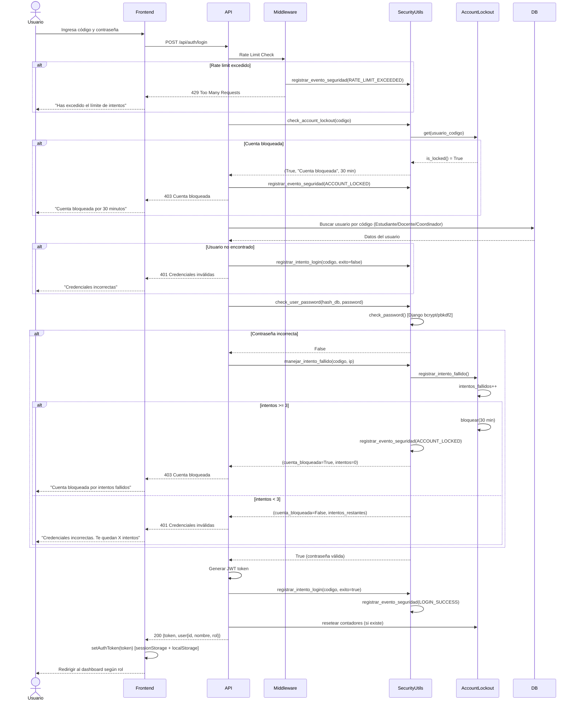

---

### 6.2 Flujo de Recuperación de Contraseña

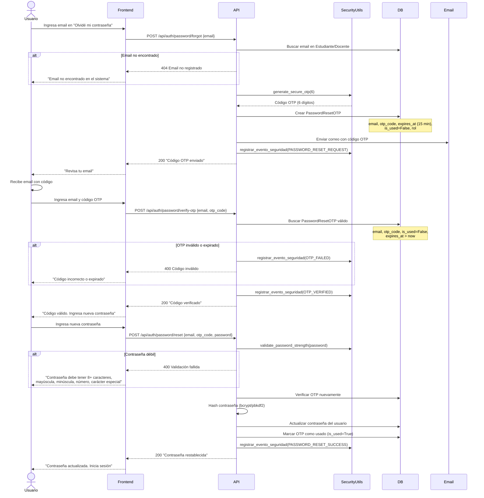

---

### 6.3 Flujo de Gestión de Actividades

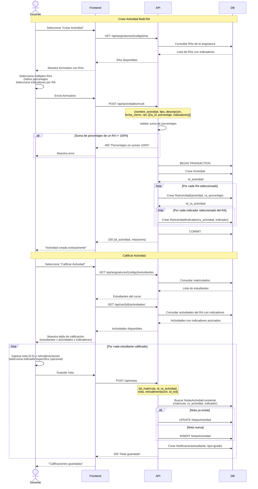

---

### 6.4 Flujo de Calificación y Visualización de Progreso

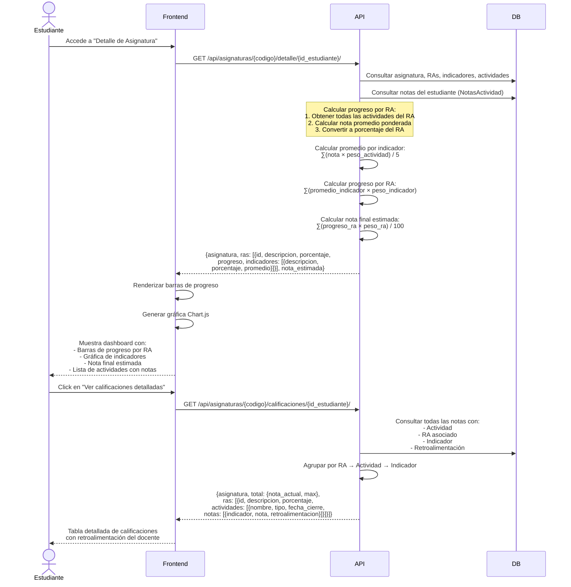

---

### 6.5 Flujo de Importación Masiva (Coordinador)

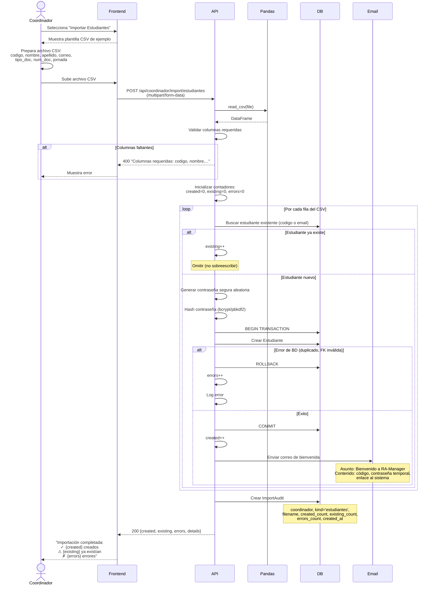

---

## 7. API / Endpoints

### 7.1 Autenticación

| Endpoint | Método | Descripción | Rol | Rate Limit |
|----------|--------|-------------|-----|------------|
| `/api/auth/login` | POST | Login con código y contraseña | Público | 5/min |
| `/api/auth/me` | GET | Obtener usuario actual | Autenticado | - |
| `/api/auth/logout` | POST | Cerrar sesión | Autenticado | - |
| `/api/auth/password/forgot` | POST | Solicitar código OTP | Público | 3/hora |
| `/api/auth/password/verify-otp` | POST | Verificar código OTP | Público | 5/min |
| `/api/auth/password/reset` | POST | Restablecer contraseña | Público | 3/hora |
| `/api/auth/profile` | GET | Obtener perfil completo | Autenticado | - |
| `/api/auth/profile` | PATCH | Actualizar perfil | Autenticado | - |
| `/api/auth/password/change` | POST | Cambiar contraseña | Autenticado | - |
| `/api/auth/profile/avatar` | POST | Subir avatar | Autenticado | - |

### 7.2 Catálogos

| Endpoint | Método | Descripción | Rol |
|----------|--------|-------------|-----|
| `/api/tipos-documento` | GET | Listar tipos de documento | Coordinador |
| `/api/tipos-actividad` | GET | Listar tipos de actividad | Docente, Coordinador |
| `/api/programas` | GET | Listar programas académicos | Coordinador |

### 7.3 Asignaturas

| Endpoint | Método | Descripción | Rol |
|----------|--------|-------------|-----|
| `/api/asignaturas` | GET | Listar asignaturas del usuario | Todos |
| `/api/asignaturas/{codigo}/estudiantes` | GET | Estudiantes por asignatura | Docente, Coordinador |
| `/api/asignaturas/{codigo}/detalle/{id}/` | GET | Detalle completo para estudiante | Estudiante, Coordinador |
| `/api/asignaturas/{codigo}/calificaciones/{id}/` | GET | Consolidado de calificaciones | Todos |
| `/api/asignaturas/{codigo}/analitica/` | GET | Análisis general de asignatura | Coordinador |
| `/api/asignaturas/{codigo}/actividades-agrupadas/` | GET | Actividades sin duplicación por RA | Docente |
| `/api/asignaturas/{codigo}/estudiante/{id}/indicadores` | GET | Gráfica de progreso por indicadores | Docente, Estudiante |

### 7.4 RAs e Indicadores

| Endpoint | Método | Descripción | Rol |
|----------|--------|-------------|-----|
| `/api/ras/{id}/indicadores/` | GET | Listar indicadores de un RA | Docente |
| `/api/ras/{id}/indicadores/` | POST | Crear indicador | Docente |
| `/api/ras/{id}/indicadores/{ind_id}/` | GET | Detalle de indicador | Docente |
| `/api/ras/{id}/indicadores/{ind_id}/` | PUT | Editar indicador | Docente |
| `/api/ras/{id}/indicadores/{ind_id}/` | DELETE | Eliminar indicador | Docente |
| `/api/validacion/ra/{id}` | GET | Validar suma de porcentajes | Docente |
| `/api/validacion/asignatura/{codigo}` | GET | Validar asignatura completa | Docente |

### 7.5 Actividades

| Endpoint | Método | Descripción | Rol |
|----------|--------|-------------|-----|
| `/api/ras/{id}/actividades/` | GET | Listar actividades de un RA | Docente |
| `/api/ras/{id}/actividades/` | POST | Crear actividad simple | Docente |
| `/api/actividades/multi` | POST | Crear actividad multi-RA | Docente |
| `/api/ras/{id}/actividades/{rel_id}/` | PUT | Editar relación RA-Actividad | Docente |
| `/api/ras/{id}/actividades/{rel_id}/` | DELETE | Eliminar actividad | Docente |

### 7.6 Calificaciones

| Endpoint | Método | Descripción | Rol |
|----------|--------|-------------|-----|
| `/api/notas` | POST | Crear/actualizar nota (upsert) | Docente |

### 7.7 Notificaciones

| Endpoint | Método | Descripción | Rol |
|----------|--------|-------------|-----|
| `/api/notificaciones` | GET | Listar notificaciones | Estudiante |
| `/api/notificaciones` | PUT | Marcar notificación como leída | Estudiante |

### 7.8 Anuncios

| Endpoint | Método | Descripción | Rol |
|----------|--------|-------------|-----|
| `/api/anuncios/{id}/` | DELETE | Eliminar anuncio | Docente |

### 7.9 Coordinador - Gestión

| Endpoint | Método | Descripción |
|----------|--------|-------------|
| `/api/coordinador/estudiantes` | GET | Listar todos los estudiantes |
| `/api/coordinador/estudiantes` | POST | Crear estudiante individual |
| `/api/coordinador/estudiantes/{id}/perfil` | GET | Perfil completo del estudiante |
| `/api/coordinador/asignaturas` | GET | Listar todas las asignaturas |
| `/api/coordinador/asignaturas/estudiantes` | GET | Estudiantes por asignatura |
| `/api/coordinador/asignaturas/ras` | GET | RAs por asignatura |
| `/api/coordinador/asignaturas/avance` | GET | Avance de RAs por asignatura |

### 7.10 Coordinador - Importaciones

| Endpoint | Método | Descripción |
|----------|--------|-------------|
| `/api/coordinador/import/matriculados` | POST | Importar matriculados CSV |
| `/api/coordinador/import/docentes` | POST | Importar docentes CSV |
| `/api/coordinador/import/estudiantes` | POST | Importar estudiantes CSV |
| `/api/coordinador/import/asignaturas-ras` | POST | Importar asignaturas y RAs CSV |

### 7.11 Docente - Gestión de Estudiantes

| Endpoint | Método | Descripción |
|----------|--------|-------------|
| `/api/docente/asignaturas/{codigo}/import/estudiantes` | POST | Importar estudiantes CSV (solo sus cursos) |
| `/api/docente/buscar-estudiante` | GET | Buscar estudiante por código |
| `/api/docente/asignaturas/{codigo}/estudiantes` | POST | Agregar estudiante individual |

### 7.12 Utilidades

| Endpoint | Método | Descripción | Rol |
|----------|--------|-------------|-----|
| `/api/periodos/actual` | GET | Obtener periodo académico actual | Todos |

---

## 8. Lógica de Negocio

### 8.1 Cálculo de Notas

#### 8.1.1 Nota por Indicador

Para un indicador específico de un RA:

```
promedio_indicador = ∑(nota_actividad × peso_actividad_en_ra) / ∑(peso_actividad_en_ra)
```

Donde:
- `nota_actividad`: Nota obtenida en una actividad (0-5)
- `peso_actividad_en_ra`: Porcentaje de la actividad dentro del RA (0-100)

#### 8.1.2 Progreso por RA

Para un RA completo:

```
progreso_ra = ∑(promedio_indicador × peso_indicador) / 100
```

Donde:
- `promedio_indicador`: Promedio calculado en el paso anterior
- `peso_indicador`: Porcentaje del indicador dentro del RA (0-100)
- `progreso_ra`: Resultado en escala 0-5

#### 8.1.3 Nota Final de Asignatura

```
nota_final = ∑(progreso_ra × peso_ra) / 100
```

Donde:
- `progreso_ra`: Progreso del RA (0-5)
- `peso_ra`: Porcentaje del RA dentro de la asignatura (0-100)
- `nota_final`: Resultado en escala 0-5

#### 8.1.4 Ejemplo Práctico

##### Estructura
- **Asignatura:** Programación I
  - **RA1 (40%):** Estructuras de control
    - Indicador 1.1 (50%): Condicionales
    - Indicador 1.2 (50%): Ciclos
  - **RA2 (60%):** Funciones y modularidad
    - Indicador 2.1 (100%): Definición de funciones

##### Actividades
- **Quiz 1 (RA1, 30%)** → califica Indicador 1.1
- **Taller 1 (RA1, 70%)** → califica Indicador 1.2
- **Proyecto (RA2, 100%)** → califica Indicador 2.1

##### Notas del Estudiante
- Quiz 1: 4.0
- Taller 1: 3.5
- Proyecto: 4.5

##### Cálculos
1. **Promedio Indicador 1.1:**
   ```
   = (4.0 × 30) / 30
   = 4.0
   ```

2. **Promedio Indicador 1.2:**
   ```
   = (3.5 × 70) / 70
   = 3.5
   ```

3. **Progreso RA1:**
   ```
   = (4.0 × 50 + 3.5 × 50) / 100
   = (200 + 175) / 100
   = 3.75
   ```

4. **Progreso RA2:**
   ```
   = (4.5 × 100) / 100
   = 4.5
   ```

5. **Nota Final:**
   ```
   = (3.75 × 40 + 4.5 × 60) / 100
   = (150 + 270) / 100
   = 4.2
   ```

### 8.2 Validación de Porcentajes

#### 8.2.1 Nivel Asignatura

```python
def validar_porcentajes_asignatura(asignatura_id):
    """
    Valida que la suma de porcentajes de todos los RAs de una asignatura sea 100%
    """
    suma = ResultadoDeAprendizaje.objects.filter(
        asignatura_id=asignatura_id
    ).aggregate(total=Sum('porcentaje_ra'))['total']
    
    return suma == Decimal('100.00')
```

#### 8.2.2 Nivel RA

```python
def validar_porcentajes_ra(ra_id):
    """
    Valida:
    1. Suma de indicadores = 100%
    2. Suma de actividades = 100%
    """
    # Validar indicadores
    suma_indicadores = IndicadoresDeLogro.objects.filter(
        ra_id=ra_id
    ).aggregate(total=Sum('porcentaje_ind'))['total']
    
    # Validar actividades
    suma_actividades = RaActividad.objects.filter(
        ra_id=ra_id
    ).aggregate(total=Sum('porcentaje_ra_actividad'))['total']
    
    return (suma_indicadores == Decimal('100.00') and 
            suma_actividades == Decimal('100.00'))
```

### 8.3 Generación de Notificaciones

#### 8.3.1 Gatillos de Notificación

Detectados en el código:

1. **Nueva calificación registrada:**
   ```python
   Notificacion.objects.create(
       estudiante=estudiante,
       tipo='grade',
       texto=f"Nueva calificación en {actividad.nombre} de {asignatura.nombre}",
       enlace=f"/materias/{asignatura.codigo}",
       leida=False
   )
   ```

2. **Recurso nuevo subido:**
   ```python
   Notificacion.objects.create(
       estudiante=estudiante,
       tipo='resource',
       texto=f"Nuevo recurso: {recurso.titulo} en {asignatura.nombre}",
       enlace=f"/materias/{asignatura.codigo}/recursos",
       leida=False
   )
   ```

3. **Actividad próxima a vencer:**
   ```python
   # Ejecutado por tarea programada (no encontrada en código actual)
   Notificacion.objects.create(
       estudiante=estudiante,
       tipo='deadline',
       texto=f"La actividad {actividad.nombre} vence en 2 días",
       enlace=f"/materias/{asignatura.codigo}",
       leida=False
   )
   ```

4. **Anuncio nuevo:**
   ```python
   Notificacion.objects.create(
       estudiante=estudiante,
       tipo='announcement',
       texto=f"Nuevo anuncio en {asignatura.nombre}: {anuncio.titulo}",
       enlace=f"/materias/{asignatura.codigo}/anuncios",
       leida=False
   )
   ```

### 8.4 Importación CSV

#### 8.4.1 Flujo General de Importación

```python
def procesar_importacion_csv(file, kind, coordinador):
    """
    Flujo común para todas las importaciones
    """
    # 1. Leer CSV con pandas
    df = pd.read_csv(file)
    
    # 2. Validar columnas requeridas
    validar_columnas(df, columnas_requeridas)
    
    # 3. Inicializar contadores
    created, existing, errors = 0, 0, 0
    
    # 4. Iterar sobre filas
    for index, row in df.iterrows():
        try:
            # 4.1. Buscar registro existente
            obj = Model.objects.filter(codigo=row['codigo']).first()
            
            if obj:
                existing += 1
                continue  # No sobreescribir
            
            # 4.2. Generar contraseña (si aplica)
            password = generar_password_seguro()
            
            # 4.3. Crear registro en transacción
            with transaction.atomic():
                nuevo = Model.objects.create(...)
                created += 1
            
            # 4.4. Enviar email de bienvenida (si aplica)
            enviar_email_bienvenida(nuevo, password)
            
        except Exception as e:
            errors += 1
            logger.error(f"Error en fila {index}: {e}")
    
    # 5. Registrar auditoría
    ImportAudit.objects.create(
        coordinador=coordinador,
        kind=kind,
        filename=file.name,
        created_count=created,
        existing_count=existing,
        errors_count=errors
    )
    
    return {
        'created': created,
        'existing': existing,
        'errors': errors
    }
```

---

## 9. Seguridad

### 9.1 Autenticación

#### 9.1.1 Mecanismo

**Sistema Detectado:** JWT (JSON Web Tokens) con Bearer Authentication

**Flujo de Autenticación:**
1. Usuario envía credenciales (código + contraseña) a `/api/auth/login`
2. Backend valida credenciales contra base de datos:
   - Busca usuario por código en tablas Estudiante/Docente/Coordinador
   - Verifica contraseña hasheada con `check_password()` de Django
3. Si es válido, genera token JWT con payload:
   ```python
   {
       'user_id': user.id,
       'codigo': user.codigo,
       'rol': 'estudiante' | 'docente' | 'coordinador',
       'exp': timestamp_expiration
   }
   ```
4. Frontend almacena token en:
   - `sessionStorage` (aislado por pestaña)
   - `localStorage` (persistencia entre recargas)
5. Todas las requests subsecuentes incluyen header:
   ```
   Authorization: Bearer <token>
   ```

**Gestión de Sesiones:**
- **sessionStorage prioritario:** Cada pestaña mantiene sesión independiente
- **localStorage como fallback:** Compatibilidad y persistencia
- **Migración automática:** Token de localStorage se copia a sessionStorage al iniciar

#### 9.1.2 Hashing de Contraseñas

**Algoritmo Detectado:** Django's contrib.auth (PBKDF2-SHA256 por defecto, compatible con Bcrypt)

**Configuración en settings.py:**
```python
AUTH_PASSWORD_VALIDATORS = [
    'django.contrib.auth.password_validation.UserAttributeSimilarityValidator',
    'django.contrib.auth.password_validation.MinimumLengthValidator',
    'django.contrib.auth.password_validation.CommonPasswordValidator',
    'django.contrib.auth.password_validation.NumericPasswordValidator',
]
```

**Función de Verificación Segura:**
```python
def check_user_password(db_password: Optional[str], provided_password: str) -> bool:
    """
    NUNCA retorna True si no hay contraseña
    NUNCA hace comparación en texto plano
    """
    if not provided_password or not db_password:
        return False
    
    try:
        return check_password(provided_password, db_password)
    except Exception:
        return False
```

**Requisitos de Contraseña:**
- Mínimo 8 caracteres
- Al menos una mayúscula
- Al menos una minúscula
- Al menos un número
- Al menos un carácter especial (!@#$%^&*()_+-=[]{}|;:,.<>?)

### 9.2 Protección contra Ataques

#### 9.2.1 Bloqueo de Cuenta por Intentos Fallidos

**Configuración:**
- **Umbral:** 3 intentos fallidos consecutivos
- **Duración de bloqueo:** 30 minutos
- **Desbloqueo automático:** Sí, tras expiración

**Implementación:**
```python
# Tras cada intento fallido
lockout.registrar_intento_fallido(ip_address)

if lockout.intentos_fallidos >= 3:
    lockout.bloquear(duracion_minutos=30)
    registrar_evento_seguridad('ACCOUNT_LOCKED', usuario_codigo, ip)
    enviar_email_alerta_bloqueo(usuario)
```

**Reseteo de contador:**
- Login exitoso resetea contador automáticamente
- Desbloqueo automático al expirar el tiempo

#### 9.2.2 Rate Limiting

**Implementación:** django-ratelimit 4.0.0

**Límites Aplicados (detectados en código):**

```python
from django_ratelimit.decorators import ratelimit

@ratelimit(key='ip', rate='5/m', method='POST')
def login_view(request):
    """5 intentos por minuto por IP"""
    pass

@ratelimit(key='ip', rate='3/h', method='POST')
def password_forgot_view(request):
    """3 solicitudes de OTP por hora por IP"""
    pass

@ratelimit(key='ip', rate='5/m', method='POST')
def verify_otp_view(request):
    """5 verificaciones por minuto por IP"""
    pass

@ratelimit(key='ip', rate='3/h', method='POST')
def password_reset_view(request):
    """3 resets por hora por IP"""
    pass
```

**Middleware de Rate Limiting:**
```python
# api/middleware/ratelimit.py
class RateLimitMiddleware:
    """
    Captura excepciones Ratelimited y:
    1. Registra evento en SecurityEvent con tipo RATE_LIMIT_EXCEEDED
    2. Retorna JSON 429 Too Many Requests
    """
```

#### 9.2.3 Recuperación de Contraseña con OTP

**Características:**
- **Código OTP:** 6 dígitos generados criptográficamente (`secrets` no `random`)
- **Expiración:** 15 minutos desde generación
- **Uso único:** OTP se marca como `is_used=True` tras uso exitoso
- **Validación estricta:** Email + código + no expirado + no usado

**Generación de OTP:**
```python
def generate_secure_otp(length: int = 6) -> str:
    """
    Usa secrets (criptográficamente seguro)
    NO usa random (predecible)
    """
    return ''.join(secrets.choice('0123456789') for _ in range(length))
```

#### 9.2.4 CORS (Cross-Origin Resource Sharing)

**Configuración en settings.py:**
```python
CORS_ALLOWED_ORIGINS = [
    'http://localhost:5173',
    'http://127.0.0.1:5173'
]

CORS_ORIGIN_ALLOW_ALL = DEBUG  # Solo en desarrollo

CSRF_TRUSTED_ORIGINS = CORS_ALLOWED_ORIGINS
```

**Producción:** Lista blanca estricta vía variable de entorno `CORS_ORIGINS`

#### 9.2.5 CSRF Protection

**Mecanismo:** Django's CSRF Middleware (incluido por defecto)

**Cliente HTTP (frontend):**
```typescript
// http.ts - Interceptor de requests
const m = document.cookie.match(/csrftoken=([^;]+)/)
if (m) {
    config.headers['X-CSRFToken'] = m[1]
}
```

**Configuración:**
```python
CSRF_COOKIE_SECURE = True  # Solo en producción (HTTPS)
```

#### 9.2.6 HTTPS/SSL

**Configuración de Producción en settings.py:**
```python
SECURE_SSL_REDIRECT = os.getenv('SECURE_SSL_REDIRECT', 'False') == 'True'
SESSION_COOKIE_SECURE = True  # Solo enviar cookies por HTTPS
CSRF_COOKIE_SECURE = True
SECURE_HSTS_SECONDS = int(os.getenv('SECURE_HSTS_SECONDS', '0'))
```

**Nota:** Activado a través de variables de entorno en producción

### 9.3 Auditoría y Logging

#### 9.3.1 LoginAttempt

**Registra:**
- Todos los intentos de login (exitosos y fallidos)
- Usuario, email, rol intentado
- IP address, User-Agent
- Motivo de fallo

**Uso:**
- Análisis forense de accesos
- Detección de patrones de ataque
- Auditoría de seguridad

#### 9.3.2 SecurityEvent

**Eventos Registrados:**
- LOGIN_SUCCESS, LOGIN_FAILED
- ACCOUNT_LOCKED, ACCOUNT_UNLOCKED
- PASSWORD_RESET_REQUEST, PASSWORD_RESET_SUCCESS
- OTP_GENERATED, OTP_VERIFIED, OTP_FAILED
- SUSPICIOUS_ACTIVITY, RATE_LIMIT_EXCEEDED

**Detalles Almacenados (JSON):**
```python
{
    'rol': 'estudiante',
    'motivo': 'Contraseña incorrecta',
    'user_agent': 'Mozilla/5.0...'
}
```

#### 9.3.3 Logging Centralizado

**Configuración (settings.py):**
```python
LOGGING = {
    'version': 1,
    'disable_existing_loggers': False,
    'handlers': {
        'console': {...},
        'file': {
            'filename': BASE_DIR / 'logs' / 'django.log',
            'maxBytes': 10485760,  # 10 MB
            'backupCount': 10,
        },
        'error_file': {
            'filename': BASE_DIR / 'logs' / 'errors.log',
            'level': 'ERROR',
        },
    },
    'root': {
        'handlers': ['console', 'file'],
        'level': 'INFO',
    },
}
```

**Middlewares de Logging:**
1. **RequestLoggingMiddleware:** Registra todas las requests entrantes
2. **ErrorHandlerMiddleware:** Captura excepciones no manejadas y loguea con contexto completo

### 9.4 Manejo de Errores

**ErrorHandlerMiddleware:**
```python
# Centraliza manejo de excepciones
# Retorna respuestas JSON estandarizadas:
{
    'success': False,
    'error': {
        'message': 'Mensaje amigable',
        'type': 'ValidationError',
        'code': 'VALIDATION_ERROR'
    }
}
```

**Tipos de Excepciones Manejadas:**
- `ValidationError` → 400 Bad Request
- `DatabaseError`/`IntegrityError` → 400 (sin exponer detalles internos)
- `PermissionDenied` → 403 Forbidden
- `APIException` (DRF) → código específico
- Genérica → 500 Internal Server Error

---

## 10. Componentes Frontend

### 10.1 Páginas por Rol

#### 10.1.1 Coordinador

| Componente | Archivo | Descripción |
|------------|---------|-------------|
| Dashboard | `Dashboard.tsx` | Métricas globales, gráficas de rendimiento |
| Estudiantes | `Estudiantes.tsx` | Lista de todos los estudiantes, crear/editar |
| Materias | `Materias.tsx` | Lista de todas las asignaturas |
| Asignatura | `Asignatura.tsx` | Vista detallada de asignatura con estudiantes y RAs |
| AsignaturaAnalisis | `AsignaturaAnalisis.tsx` | Análisis profundo de rendimiento de asignatura |
| Imports | `Imports.tsx` | Interface de importación masiva de datos CSV |

#### 10.1.2 Docente

| Componente | Archivo | Descripción |
|------------|---------|-------------|
| Cursos | `Cursos.tsx` | Lista de asignaturas del docente |
| RAs | `RAs.tsx` | Gestión de RAs e indicadores de una asignatura |
| Calificar | `Calificar.tsx` | Interface de calificación de estudiantes |
| CrearActividad | `CrearActividad.tsx` | Formulario para crear actividades |
| NuevaActividad | `NuevaActividad.tsx` | Wizard para actividades multi-RA |
| Recursos | `Recursos.tsx` | Gestión de recursos educativos (subir/listar) |

#### 10.1.3 Estudiante

| Componente | Archivo | Descripción |
|------------|---------|-------------|
| MateriaDetalle | `MateriaDetalle.tsx` | Vista completa de asignatura con notas, progreso, actividades |

#### 10.1.4 Compartidas

| Componente | Archivo | Descripción |
|------------|---------|-------------|
| Login | `Login.tsx` | Autenticación con código y contraseña |
| Recuperar | `Recuperar.tsx` | Solicitud de OTP para recuperación |
| Reset | `Reset.tsx` | Restablecimiento de contraseña con OTP |
| Profile | `Profile.tsx` | Perfil del usuario (ver/editar) |

### 10.2 Componentes Reutilizables

| Componente | Archivo | Descripción |
|------------|---------|-------------|
| HeaderBar | `HeaderBar.tsx` | Barra superior con título y acciones |
| Sidebar | `Sidebar.tsx` | Menú lateral según rol del usuario |
| Alert | `Alert.tsx` | Alertas estáticas en la página (4 tipos: success, error, warning, info) |
| Toast | `Toast.tsx` | Toasts flotantes con auto-cierre configurable |
| Spinner | `Spinner.tsx` | Indicador de carga |
| Skeleton | `Skeleton.tsx` | Placeholder de carga para contenido |
| NotificationsBell | `NotificationsBell.tsx` | Campana de notificaciones con contador |
| ActivityDetailsModal | `ActivityDetailsModal.tsx` | Modal para ver detalles de actividad |
| ProgressModal | `ProgressModal.tsx` | Modal con progreso de RAs |
| RaCard | `RaCard.tsx` | Tarjeta de RA con barra de progreso |
| GradeSummary | `GradeSummary.tsx` | Resumen de calificaciones con nota final |
| StudentList | `StudentList.tsx` | Lista de estudiantes con búsqueda |
| ConfirmDialog | `ConfirmDialog.tsx` | Diálogo de confirmación (usando SweetAlert2) |
| ErrorBoundary | `ErrorBoundary.tsx` | Captura errores de React |
| Dropdown | `Dropdown.tsx` | Menú desplegable reutilizable |
| SearchPill | `SearchPill.tsx` | Input de búsqueda con estilo pill |
| CardGrid | `CardGrid.tsx` | Grilla de tarjetas responsive |
| EstudiantePerfilModal | `EstudiantePerfilModal.tsx` | Modal con perfil completo de estudiante |

### 10.3 Servicios

#### 10.3.1 Servicios de Autenticación (auth.ts)

```typescript
login(code: string, password: string): Promise<UserProfile>
logout(): Promise<void>
requestPasswordReset(email: string): Promise<void>
verifyOTP(email: string, otp_code: string): Promise<void>
resetPassword(email: string, otp_code: string, password: string): Promise<void>
getProfile(): Promise<UserProfile>
getFullProfile(): Promise<ProfileDetails>
updateProfile(patch: Partial<ProfileData>): Promise<ProfileDetails>
changePassword(current: string, new: string): Promise<void>
uploadAvatar(file: File): Promise<string>
```

#### 10.3.2 Servicios Generales de API (api.ts)

```typescript
getCourses(): Promise<Course[]>
getRAsByCourse(courseId: string): Promise<RA[]>
getStudentsByCourse(courseId: string, opts?: FilterOpts): Promise<Student[]>
getIndicatorsByRA(raId: string): Promise<Indicator[]>
createActivityForRA(raId: string, payload: ActivityPayload): Promise<Activity>
createActivityMulti(payload: MultiActivityPayload): Promise<ActivityMultiResult>
upsertGrade(input: GradeInput): Promise<void>
getIndicatorChart(courseId: string, studentId: string): Promise<ChartData[]>
getCourseGradeSummary(code: string, studentId: string): Promise<GradeSummary>
getCourseDetail(code: string, studentId: string): Promise<CourseDetail>
```

#### 10.3.3 Servicios del Coordinador (coordinador.ts)

```typescript
getEstudiantes(): Promise<Estudiante[]>
crearEstudiante(data: EstudianteData): Promise<void>
getEstudiantePerfil(id: number): Promise<EstudiantePerfilCompleto>
getAsignaturas(): Promise<Asignatura[]>
getAsignaturaEstudiantes(params: FiltroParams): Promise<AsignaturaEstudiante[]>
getAsignaturaRAs(params: FiltroParams): Promise<AsignaturaRA[]>
getAsignaturaAvance(params: FiltroParams): Promise<AsignaturaAvance[]>
importarMatriculados(file: File): Promise<ImportResult>
importarDocentes(file: File): Promise<ImportResult>
importarEstudiantes(file: File): Promise<ImportResult>
importarAsignaturasRAs(file: File): Promise<ImportResult>
```

### 10.4 Gestión de Estado

**Mecanismo Detectado:** Context API de React (state/UserContext, state/AuthContext, etc.)

**Estado Global Típico:**
```typescript
interface UserState {
  user: UserProfile | null
  isAuthenticated: boolean
  loading: boolean
  login: (code: string, pwd: string) => Promise<void>
  logout: () => Promise<void>
  refreshProfile: () => Promise<void>
}
```

### 10.5 HTTP Client

**Configuración (connections/http.ts):**

```typescript
export const api = axios.create({
  baseURL: import.meta.env.VITE_API_URL || 'http://localhost:8000/api',
  withCredentials: true,
  timeout: 30000,
})

// Interceptor de Request
api.interceptors.request.use((config) => {
  // Agregar Bearer token desde sessionStorage/localStorage
  const token = getAuthToken()
  if (token) {
    config.headers.Authorization = `Bearer ${token}`
  }
  
  // Agregar CSRF token desde cookies
  const csrf = document.cookie.match(/csrftoken=([^;]+)/)
  if (csrf) {
    config.headers['X-CSRFToken'] = csrf[1]
  }
  
  return config
})

// Interceptor de Response
api.interceptors.response.use(
  response => response,
  error => {
    // Manejo de errores 401 (redirect a login)
    // Manejo de errores 403 (permiso denegado)
    // Manejo de errores 429 (rate limit)
    // Mostrar alertas/toasts de error
    return Promise.reject(error)
  }
)
```

### 10.6 Visualización de Datos

**Librería:** Chart.js 4.5.0

**Tipos de Gráficas Detectadas:**
1. **Barras de Progreso:** RAs, Indicadores (barra horizontal con porcentaje)
2. **Gráfica de Barras:** Promedio por indicador vs objetivo
3. **Gráfica de Líneas:** Evolución temporal de notas (si aplica)
4. **Gráfica Radial:** Comparativa de progreso de RAs

**Implementación Típica:**
```typescript
import { Chart } from 'chart.js/auto'

const chartData = {
  labels: indicadores.map(i => i.descripcion),
  datasets: [{
    label: 'Promedio',
    data: indicadores.map(i => i.avg_nota),
    backgroundColor: 'rgba(54, 162, 235, 0.5)',
  }]
}

const config = {
  type: 'bar',
  data: chartData,
  options: {
    responsive: true,
    scales: {
      y: { min: 0, max: 5 }
    }
  }
}
```

---

## 11. Diagramas de Arquitectura Adicionales

### 11.1 Diagrama de Componentes

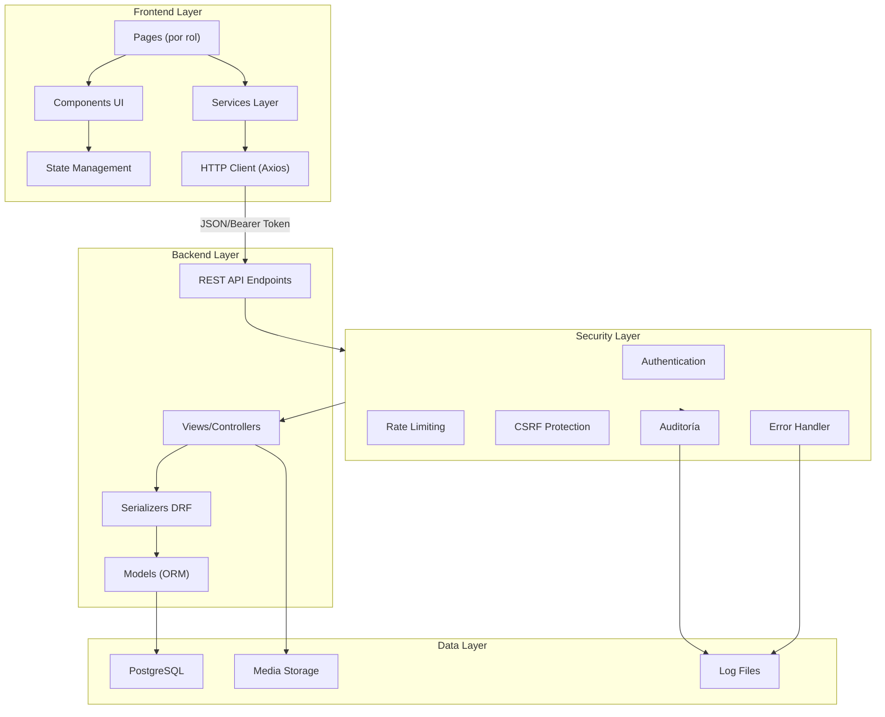

### 11.2 Diagrama de Secuencia: Calificación de Actividad

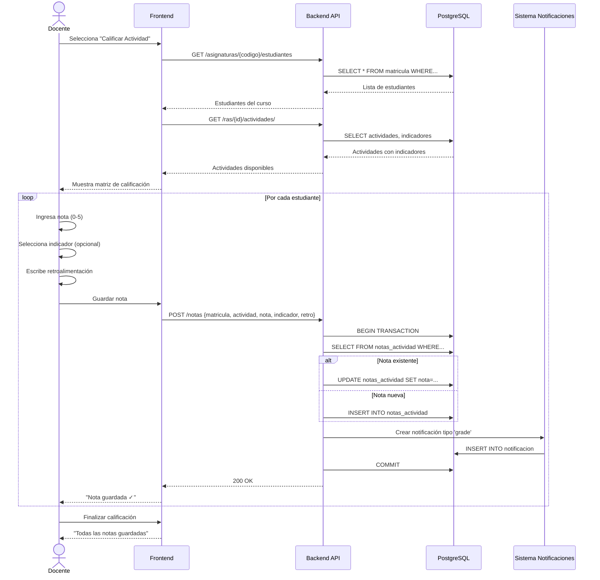

### 11.3 Diagrama de Dependencias

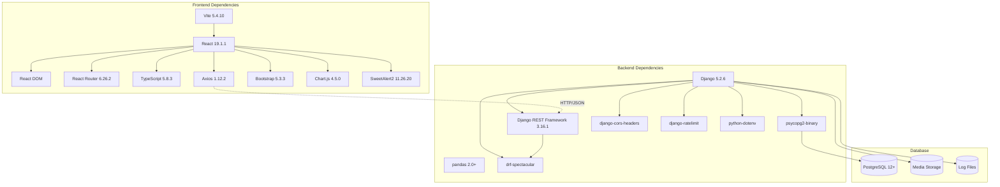

### 11.4 Diagrama de Flujo: Validación de Porcentajes

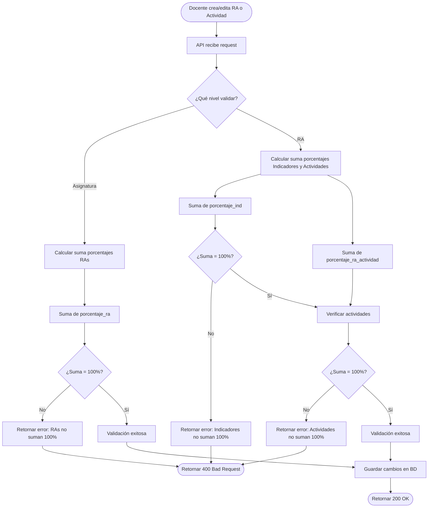

---

## 12. Conclusión Técnica

### 12.1 Resumen de la Arquitectura

RA-Manager es un sistema web moderno de gestión académica basado en una arquitectura **Cliente-Servidor desacoplada** con las siguientes características:

**Backend (Django + DRF):**
- API REST robusta con documentación automática (OpenAPI)
- ORM Django para abstracción de base de datos PostgreSQL
- Middleware personalizado para seguridad, logging y rate limiting
- Serializers para validación y transformación de datos
- Sistema de auditoría completo (login, importaciones, eventos de seguridad)

**Frontend (React + TypeScript):**
- SPA (Single Page Application) con routing del lado del cliente
- Arquitectura basada en componentes reutilizables
- Gestión de estado con Context API
- Cliente HTTP centralizado con interceptores
- Visualización de datos con Chart.js
- UI moderna con Bootstrap 5

**Seguridad:**
- Autenticación JWT con tokens Bearer
- Hashing de contraseñas con PBKDF2/Bcrypt
- Protección contra fuerza bruta (bloqueo de cuenta)
- Rate limiting por IP
- CSRF protection
- Auditoría completa de eventos de seguridad
- OTP de 6 dígitos para recuperación de contraseña

**Base de Datos:**
- 23 modelos principales
- Relaciones complejas N:M con tablas intermedias
- Constraints de integridad referencial
- Índices para optimización de queries
- Validaciones de porcentajes (sumas deben ser 100%)

---

### 12.2 Fortalezas del Sistema

1. **Arquitectura Escalable:**
   - Separación completa frontend-backend
   - API REST stateless
   - Modelos de datos normalizados

2. **Seguridad Robusta:**
   - Múltiples capas de protección (autenticación, rate limiting, bloqueo de cuentas)
   - Auditoría completa de eventos críticos
   - Hashing seguro de contraseñas
   - OTP para recuperación de contraseña

3. **Flexibilidad Académica:**
   - Actividades multi-RA (evaluaciones integradoras)
   - Calificación diferenciada por indicador de logro
   - Importación masiva de datos CSV

4. **Experiencia de Usuario:**
   - Interfaz moderna y responsiva (Bootstrap 5)
   - Visualizaciones interactivas (Chart.js)
   - Sistema de notificaciones persistente
   - Alertas contextuales y toasts

5. **Trazabilidad:**
   - Auditoría de importaciones (`ImportAudit`)
   - Registro de intentos de login (`LoginAttempt`)
   - Bitácora de eventos de seguridad (`SecurityEvent`)
   - Logging centralizado con rotación de archivos

6. **Documentación:**
   - README completo con guías de instalación
   - CHANGELOG para seguimiento de cambios
   - Documentación API automática con drf-spectacular

---

### 12.3 Posibles Mejoras Detectadas

Basadas únicamente en el análisis del código:

1. **Testing:**
   - No se detectaron archivos de tests unitarios (tests.py vacíos)
   - Agregar tests de integración para flujos críticos
   - Tests de carga para rate limiting

2. **Caché:**
   - No se detectó uso de caché (Redis, Memcached)
   - Implementar caché para queries frecuentes (lista de asignaturas, RAs)
   - Caché de cálculos de progreso (computacionalmente costosos)

3. **Tareas Asíncronas:**
   - No se detectó Celery o sistema de colas
   - Procesamiento de importaciones CSV en background
   - Envío de emails asíncrono
   - Cálculo de notas finales al cierre de periodos

4. **Notificaciones en Tiempo Real:**
   - Sistema actual es pull (polling)
   - Implementar WebSockets para push de notificaciones

5. **Exportación de Reportes:**
   - No se detectó generación de PDF
   - Exportación de consolidados de notas a Excel
   - Reportes de rendimiento por periodo

6. **Búsqueda Avanzada:**
   - Implementar búsqueda full-text en PostgreSQL
   - Filtros avanzados en listados (por programa, periodo, rango de notas)

7. **Gestión de Recursos:**
   - Límite de tamaño de archivos (no detectado)
   - Validación de tipos MIME (seguridad)
   - CDN para archivos estáticos en producción

8. **Monitoreo:**
   - Integración con Sentry para tracking de errores
   - Métricas de rendimiento (APM)
   - Dashboard de salud del sistema

9. **Backup Automatizado:**
   - Respaldos periódicos de base de datos
   - Respaldos de archivos media/
   - Retención de backups configurables

10. **Documentación Técnica:**
    - Diagramas de arquitectura (ahora generados en este documento)
    - Guía de contribución detallada
    - Documentación de decisiones de diseño (ADR - Architecture Decision Records)

---

### 12.4 Observaciones Finales

El proyecto **RA-Manager** demuestra una arquitectura sólida y moderna, con enfoque en:

- **Seguridad:** Múltiples capas de protección y auditoría exhaustiva
- **Usabilidad:** Interfaces diferenciadas por rol con visualizaciones claras
- **Flexibilidad:** Modelo académico flexible (actividades multi-RA, indicadores)
- **Mantenibilidad:** Código organizado, separación de responsabilidades clara

El sistema está **listo para producción** con las configuraciones adecuadas de variables de entorno (SECRET_KEY, DB_PASSWORD, ALLOWED_HOSTS, etc.).

Las mejoras sugeridas son **optimizaciones** que pueden implementarse de forma incremental sin afectar la funcionalidad core del sistema.

---

**Fin del Documento de Arquitectura**

---

## Apéndice A: Variables de Entorno Requeridas

El sistema requiere las siguientes variables de entorno en archivo `.env`:

```bash
# Seguridad
SECRET_KEY=django-insecure-CAMBIAR-EN-PRODUCCION
DEBUG=False

# Base de Datos
DB_NAME=ra_manager
DB_USER=postgres
DB_PASSWORD=tu_password_seguro
DB_HOST=localhost
DB_PORT=5432

# Hosts Permitidos
ALLOWED_HOSTS=localhost,127.0.0.1,tu-dominio.com

# CORS
CORS_ORIGINS=http://localhost:5173,https://tu-dominio.com

# Frontend
FRONTEND_URL=http://localhost:5173

# SSL/HTTPS (Producción)
SECURE_SSL_REDIRECT=True
SECURE_HSTS_SECONDS=31536000
SESSION_COOKIE_SECURE=True
CSRF_COOKIE_SECURE=True
```

---

## Apéndice B: Comandos de Django Detectados

Ubicación: `backend/api/management/commands/` (directorio existe pero vacío en el código analizado)

**Comandos potenciales no implementados:**
- `calcular_notas_finales`: Calcular y actualizar nota_final en Matricula
- `limpiar_otps_expirados`: Limpiar OTPs expirados de la BD
- `desbloquear_cuentas`: Desbloquear cuentas automáticamente
- `enviar_recordatorios`: Enviar emails de actividades próximas a vencer

---

## Apéndice C: Migraciones de Base de Datos

Migraciones detectadas en `backend/api/migrations/`:

**Importantes:**
- `0001_initial.py`: Creación inicial de modelos
- `0002_actividad_docente_estudiante_programa_tipoactividad...`: Modelos académicos
- `0005_notasactividad_indicador.py`: Soporte para calificación por indicador
- `0006_recurso.py`: Sistema de recursos educativos
- `0008_raactividadindicador.py`: Relación actividad-indicador
- `0014_create_coordinador.py`: Modelo de coordinador
- `0015_hash_coordinador_password.py`: Migración de contraseñas a hash
- `0018_importaudit_remove_actividad_chk_act_pct_and_more.py`: Auditoría de importaciones
- `0021_passwordresetotp.py`: Sistema de recuperación de contraseña

**Nota:** Secuencia de migraciones completa garantiza integridad de la base de datos.

---

**Documento generado el 4 de marzo de 2026 mediante análisis exhaustivo del código fuente del proyecto RA-Manager.**
