# 🏗️ ARQUITECTURA DEL SISTEMA RA-MANAGER

**Fecha de elaboración:** 4 de marzo de 2026  
**Proyecto:** RA-Manager (Sistema de Gestión de Resultados de Aprendizaje)  
**Stack tecnológico:** Django 5.2.6 + DRF + React 19 + TypeScript + PostgreSQL  
**Autor:** Documentación generada a partir del análisis del código fuente

---

## 📋 ÍNDICE

1. [Descripción General del Sistema](#1-descripción-general-del-sistema)
2. [Roles del Sistema](#2-roles-del-sistema)
3. [Diagramas de Casos de Uso](#3-diagramas-de-casos-de-uso)
4. [Diagrama de Clases](#4-diagrama-de-clases)
5. [Modelo Relacional](#5-modelo-relacional)
6. [Diagrama de Componentes](#6-diagrama-de-componentes)
7. [Diagrama de Despliegue Actual](#7-diagrama-de-despliegue-actual)
8. [Diagrama de Despliegue Ideal](#8-diagrama-de-despliegue-ideal)
9. [Flujo de Autenticación](#9-flujo-de-autenticación)
10. [Flujo de Calificación](#10-flujo-de-calificación)
11. [Arquitectura de Módulos](#11-arquitectura-de-módulos)

---

## 1. DESCRIPCIÓN GENERAL DEL SISTEMA

### 1.1 Propósito del sistema

**RA-Manager** es un sistema de gestión académica enfocado en el seguimiento de **Resultados de Aprendizaje (RAs)** e **Indicadores de Logro** para programas educativos. Permite a docentes:

- Crear y gestionar actividades evaluativas asociadas a RAs
- Calificar estudiantes por indicadores de logro
- Publicar recursos educativos
- Comunicarse mediante anuncios

A estudiantes:
- Consultar sus calificaciones y avance por RA
- Descargar recursos educativos
- Recibir notificaciones de nuevas calificaciones

A coordinadores:
- Gestionar estudiantes, docentes y asignaturas
- Importar datos masivos (matrículas, calificaciones)
- Monitorear avance académico general
- Analizar rendimiento por asignatura

### 1.2 Arquitectura general

El sistema implementa una **arquitectura de tres capas** con separación cliente-servidor:

- **Frontend:** Single Page Application (SPA) desarrollada en **React 19 con TypeScript**
- **Backend:** API RESTful desarrollada con **Django 5.2.6 y Django REST Framework 3.16**
- **Base de datos:** **PostgreSQL** (producción) / SQLite (desarrollo)

**Comunicación:** HTTP/JSON mediante cliente **Axios** con autenticación por tokens Bearer.

### 1.3 Tecnologías utilizadas

#### Backend
```yaml
Framework: Django 5.2.6
API: Django REST Framework 3.16.1
Base de datos:
  - PostgreSQL (producción)
  - psycopg2-binary 2.9.0
Seguridad:
  - django-cors-headers 4.0.0
  - django-ratelimit 4.0.0
  - Hashing: bcrypt/pbkdf2 (Django Auth)
Procesamiento de datos:
  - pandas 2.0.0
  - openpyxl 3.1.0 (Excel)
Documentación:
  - drf-spectacular 0.27.0 (OpenAPI/Swagger)
Configuración:
  - python-dotenv 1.0.0
```

#### Frontend
```yaml
Framework: React 19.1.1
Lenguaje: TypeScript 5.8.3
Bundler: Vite 5.4.10
UI Framework: Bootstrap 5.3.3 + Bootstrap Icons 1.11.3
HTTP Client: Axios 1.12.2
Gráficos: Chart.js 4.5.0
Alertas: SweetAlert2 11.26.20
Routing: react-router-dom 6.26.2
Testing:
  - Vitest 2.1.1
  - Testing Library (React 16.3.0)
```

---

## 2. ROLES DEL SISTEMA

El sistema identifica **tres roles principales** basados en el análisis del código:

### 2.1 Estudiante

**Entidad:** `Estudiante` (modelo en `api/models/models.py`)

**Atributos principales:**
- `codigo_estudiante` (único)
- `nombre`, `apellido`
- `correo` (único)
- `contrasena_estudiante` (hasheada)
- `tipo_documento`, `num_documento`
- `jornada`

**Permisos:**
- Consultar sus propias calificaciones
- Ver resultados de aprendizaje de sus asignaturas
- Descargar recursos educativos
- Recibir notificaciones
- Ver anuncios de sus docentes
- Actualizar su perfil personal

**Restricciones:**
- NO puede crear actividades
- NO puede calificar
- NO puede ver información de otros estudiantes
- NO puede gestionar usuarios

---

### 2.2 Docente

**Entidad:** `Docente` (modelo en `api/models/models.py`)

**Atributos principales:**
- `codigo_docente` (único)
- `nombre`, `apellido`
- `correo` (único)
- `contrasenia_docente` (hasheada)
- `tipo_documento`, `num_documento`
- `num_telefono`

**Permisos:**
- Gestionar actividades de sus asignaturas
- Calificar estudiantes (notas por indicador)
- Publicar recursos educativos
- Crear anuncios para sus estudiantes
- Consultar listado de estudiantes matriculados en sus cursos
- Importar estudiantes individualmente o por CSV
- Consultar analítica de rendimiento de sus asignaturas

**Restricciones:**
- Solo puede acceder a sus propias asignaturas
- NO puede crear asignaturas ni RAs (establecidos por coordinador)
- NO puede modificar estructuras de RAs/indicadores
- NO puede acceder a datos de asignaturas de otros docentes

---

### 2.3 Coordinador

**Entidad:** `Coordinador` (modelo en `api/models/models.py`)

**Atributos principales:**
- `codigo_coordinador` (único)
- `nombre`
- `correo` (único)
- `contrasenia_coord` (hasheada)

**Permisos (administrativos):**
- Gestionar estudiantes (CRUD completo)
- Gestionar docentes (crear, listar)
- Gestionar asignaturas y programas
- Importar datos masivos:
  - Matrículas (CSV/Excel)
  - Docentes (CSV/Excel)
  - Estudiantes (CSV/Excel)
  - Asignaturas con RAs (CSV/Excel)
- Consultar analíticas globales
- Monitorear avance de asignaturas
- Ver perfil completo de estudiantes
- Auditar importaciones

**Restricciones:**
- NO puede calificar directamente (es rol administrativo)
- NO puede crear actividades (responsabilidad de docentes)

---

## 3. DIAGRAMAS DE CASOS DE USO

### 3.1 Casos de uso: Estudiante

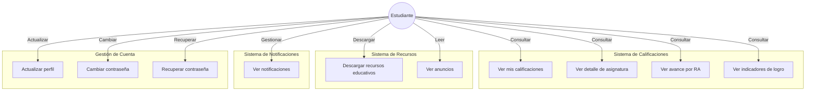

---

### 3.2 Casos de uso: Docente

```mermaid
graph TD
    Docente((Docente))
    
    Docente -->|Gestionar| UC1[Crear actividad]
    Docente -->|Gestionar| UC2[Editar actividad]
    Docente -->|Gestionar| UC3[Eliminar actividad]
    Docente -->|Asociar| UC4[Vincular actividad a RAs]
    Docente -->|Calificar| UC5[Ingresar notas por indicador]
    Docente -->|Calificar| UC6[Editar notas existentes]
    Docente -->|Calificar| UC7[Agregar retroalimentación]
    Docente -->|Consultar| UC8[Ver listado de estudiantes]
    Docente -->|Consultar| UC9[Ver analítica de asignatura]
    Docente -->|Gestionar| UC10[Publicar recursos]
    Docente -->|Gestionar| UC11[Crear anuncios]
    Docente -->|Gestionar| UC12[Eliminar anuncios]
    Docente -->|Importar| UC13[Agregar estudiante individual]
    Docente -->|Importar| UC14[Importar estudiantes CSV]
    Docente -->|Actualizar| UC15[Actualizar perfil]
    
    subgraph "Gestión de Actividades"
        UC1
        UC2
        UC3
        UC4
    end
    
    subgraph "Sistema de Calificaciones"
        UC5
        UC6
        UC7
    end
    
    subgraph "Gestión de Estudiantes"
        UC8
        UC13
        UC14
    end
    
    subgraph "Recursos y Comunicación"
        UC10
        UC11
        UC12
    end
    
    subgraph "Analítica"
        UC9
    end
```

---

### 3.3 Casos de uso: Coordinador

```mermaid
graph TD
    Coord((Coordinador))
    
    Coord -->|Gestionar| UC1[Crear estudiante]
    Coord -->|Gestionar| UC2[Editar estudiante]
    Coord -->|Gestionar| UC3[Ver perfil completo estudiante]
    Coord -->|Gestionar| UC4[Listar todos los estudiantes]
    Coord -->|Importar| UC5[Importar estudiantes masivo]
    Coord -->|Importar| UC6[Importar docentes]
    Coord -->|Importar| UC7[Importar matrículas]
    Coord -->|Importar| UC8[Importar asignaturas con RAs]
    Coord -->|Consultar| UC9[Ver todas las asignaturas]
    Coord -->|Consultar| UC10[Ver estudiantes por asignatura]
    Coord -->|Consultar| UC11[Ver RAs por asignatura]
    Coord -->|Consultar| UC12[Ver avance por asignatura]
    Coord -->|Analizar| UC13[Analítica global de asignatura]
    Coord -->|Auditar| UC14[Ver historial de importaciones]
    Coord -->|Gestionar| UC15[Ver periodo académico actual]
    
    subgraph "Gestión de Estudiantes"
        UC1
        UC2
        UC3
        UC4
        UC5
    end
    
    subgraph "Importaciones Masivas"
        UC6
        UC7
        UC8
    end
    
    subgraph "Consultas Administrativas"
        UC9
        UC10
        UC11
        UC12
    end
    
    subgraph "Analítica y Auditoría"
        UC13
        UC14
    end
```

---

## 4. DIAGRAMA DE CLASES

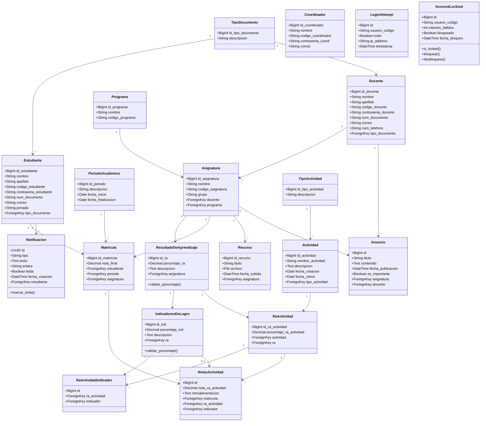

---

## 5. MODELO RELACIONAL

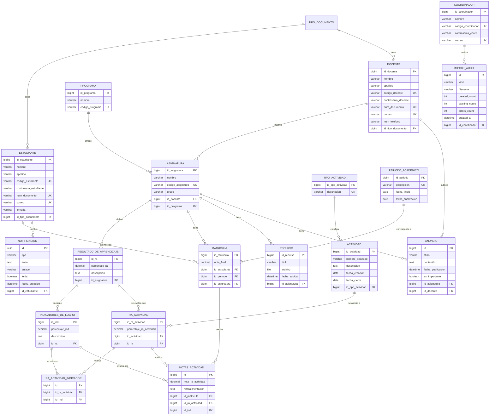

**Restricciones de integridad identificadas:**
- `chk_ra_pct`: Porcentajes de RA entre 0 y 100
- `chk_ind_pct`: Porcentajes de indicadores entre 0 y 100
- `chk_nota_final`: Nota final entre 0 y 5
- `chk_nota_ra`: Nota de actividad entre 0 y 5
- `chk_periodo_fechas`: Fecha finalización >= fecha inicio
- `chk_act_fechas`: Fecha cierre >= fecha creación
- `uq_matricula`: Unique(estudiante, periodo, asignatura)
- `uq_ra_act`: Unique(actividad, ra)
- `uq_notas_actividad_indicador`: Unique(matricula, ra_actividad, indicador)

---

## 6. DIAGRAMA DE COMPONENTES

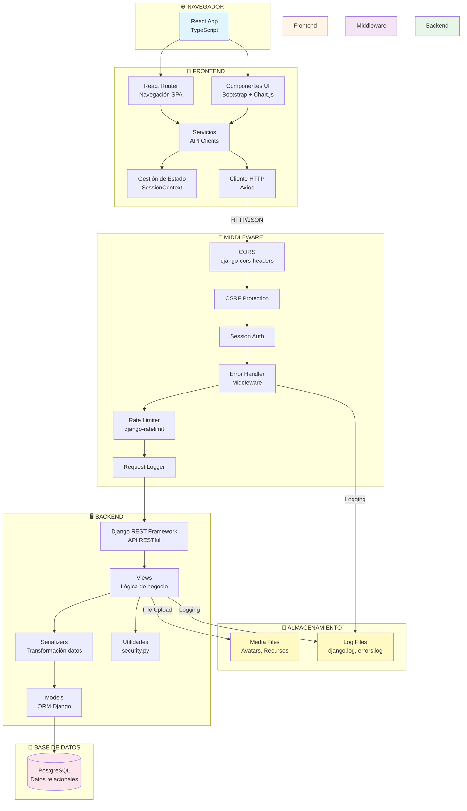

**Descripción de componentes:**

| Componente | Tecnología | Responsabilidad |
|------------|------------|-----------------|
| React App | React 19 + TS | Interfaz de usuario interactiva |
| React Router | react-router-dom | Navegación SPA sin recargas |
| Servicios | Axios | Comunicación con API backend |
| Estado | Context API | Gestión de sesión de usuario |
| Django REST Framework | DRF 3.16 | Exposición de API REST |
| Views | Django | Lógica de negocio y controladores |
| Serializers | DRF | Validación y serialización JSON |
| Models | Django ORM | Mapeo objeto-relacional |
| PostgreSQL | RDBMS | Persistencia de datos |
| Media Files | FileSystemStorage | Almacenamiento de archivos |

---

## 7. DIAGRAMA DE DESPLIEGUE ACTUAL

```mermaid
graph TB
    subgraph "💻 MÁQUINA DE DESARROLLO"
        subgraph "🖥️ Node.js (localhost:5173)"
            Frontend[Vite Dev Server<br/>React App]
        end
        
        subgraph "🐍 Python (localhost:8000)"
            Django[Django Dev Server<br/>manage.py runserver]
        end
        
        subgraph "🗄️ PostgreSQL (localhost:5432)"
            DB[(Base de datos<br/>ra_manager)]
        end
        
        subgraph "📁 Sistema de archivos"
            Media[/media/<br/>avatars, recursos]
            Logs[/logs/<br/>django.log, errors.log]
        end
    end
    
    Frontend -->|HTTP GET/POST| Django
    Django -->|SQL Queries| DB
    Django -->|Read/Write| Media
    Django -->|Write| Logs
    
    style Frontend fill:#61dafb
    style Django fill:#0c4b33
    style DB fill:#336791
    style Media fill:#ffa726
    style Logs fill:#ffa726
```

**Configuración actual (desarrollo):**

```yaml
Frontend:
  Host: localhost
  Port: 5173
  Server: Vite Dev Server
  Hot Reload: Activado
  
Backend:
  Host: localhost
  Port: 8000
  Server: Django Development Server (manage.py runserver)
  Workers: 1 (single-threaded)
  Debug: True
  
Database:
  Engine: PostgreSQL
  Host: localhost
  Port: 5432
  Name: ra_manager
  Connection Pool: Por defecto de Django
  
CORS:
  Allowed Origins:
    - http://localhost:5173
    - http://127.0.0.1:5173
  Allow All: True (en desarrollo)
  
Session:
  Backend: django.contrib.sessions.backends.db
  Cookie Secure: False (en desarrollo)
  
Static Files:
  Served by: Django staticfiles
  
Media Files:
  Storage: FileSystemStorage
  Location: /media/
```

---

## 8. DIAGRAMA DE DESPLIEGUE IDEAL (PRODUCCIÓN ESCALABLE)

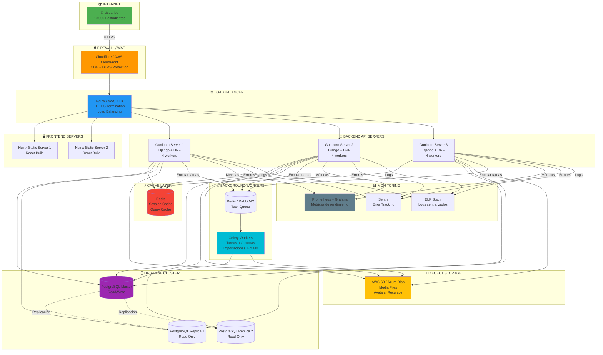

**Configuración recomendada para producción:**

```yaml
Infraestructura:
  Cloud Provider: AWS / Azure / GCP
  Regions: Multi-región para redundancia
  
Frontend:
  Deployment: Static Build (npm run build)
  Hosting: S3 + CloudFront / Azure Blob + CDN
  Servers: Nginx (2+ instancias)
  Cache: Browser cache + CDN edge cache
  
Load Balancer:
  Type: Application Load Balancer
  SSL: AWS Certificate Manager / Let's Encrypt
  Health Checks: /api/health (endpoint a crear)
  Sticky Sessions: Habilitado para WebSockets
  
Backend API:
  Server: Gunicorn con 4-8 workers por instancia
  Instances: 3+ (auto-scaling)
  Workers: (2 × CPU cores) + 1
  Timeout: 60 segundos
  Keep-alive: 5 segundos
  
Cache:
  Engine: Redis 7.x
  Deployment: AWS ElastiCache / Azure Cache
  Use Cases:
    - Session storage
    - Query result caching
    - Rate limiting
    - Task queue (Celery)
  TTL: Variable por tipo de dato
  
Database:
  Primary: PostgreSQL 16.x (Master)
  Replicas: 2+ (Read replicas)
  Connection Pooling: PgBouncer (max 100 connections)
  Backups: Automated daily + point-in-time recovery
  Storage: SSD con IOPS provisionados
  
Object Storage:
  Service: AWS S3 / Azure Blob Storage
  Buckets:
    - media-avatars (público con CloudFront)
    - media-recursos (privado con signed URLs)
  Lifecycle: Archivar recursos > 2 años a Glacier
  
Background Workers:
  Framework: Celery
  Broker: Redis / RabbitMQ
  Workers: 4+ instancias
  Queues:
    - default (baja prioridad)
    - high_priority (importaciones, notificaciones)
    - email (envío de correos)
  Monitoring: Flower (Celery Monitoring)
  
Monitoring y Observabilidad:
  Métricas: Prometheus + Grafana
    - Request rate, latency, error rate
    - Database connections, query time
    - Memory, CPU usage
  Logging: ELK Stack (Elasticsearch, Logstash, Kibana)
    - Logs centralizados de todas las instancias
    - Alertas por patrones de errores
  Error Tracking: Sentry
    - Captura de excepciones en tiempo real
    - Stack traces con contexto
  Uptime Monitoring: Pingdom / UptimeRobot
    
Security:
  WAF: AWS WAF / Cloudflare
  DDoS Protection: Shield Advanced
  Secrets: AWS Secrets Manager / Azure Key Vault
  SSL/TLS: TLS 1.3 mínimo
  
Escalabilidad estimada:
  Usuarios concurrentes: 1,000+
  Estudiantes totales: 10,000+
  Requests por segundo: 500+
  Tiempo de respuesta promedio: < 200ms
```

---

## 9. FLUJO DE AUTENTICACIÓN

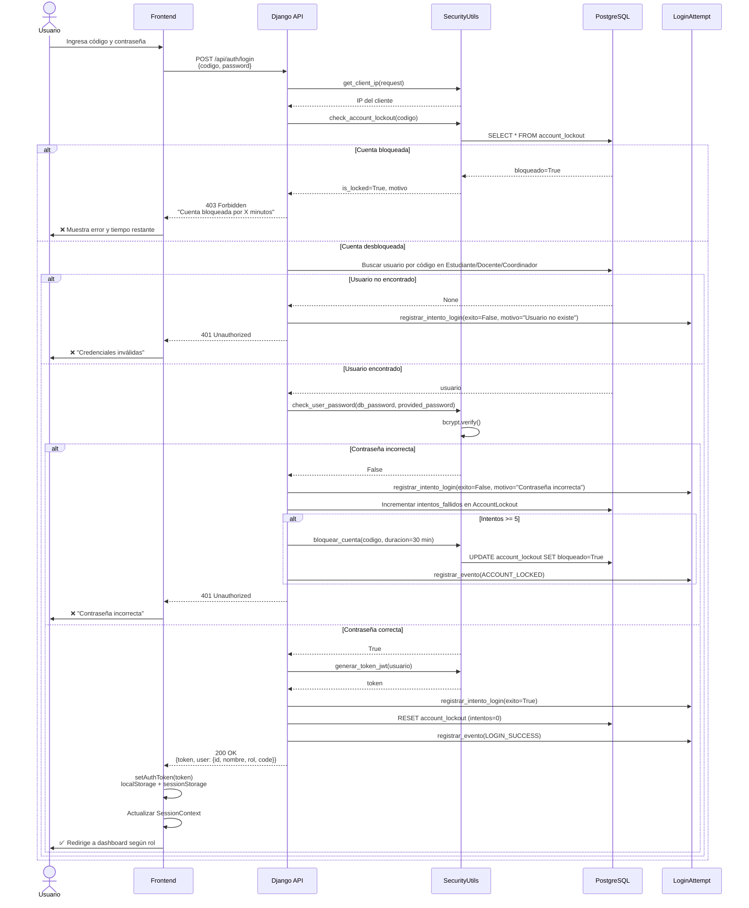

**Detalles de implementación:**

```python
# Token format (Django signing)
token = signing.dumps({
    'id': user.pk,
    'rol': 'docente|estudiante|coordinador',
    'code': user.codigo_xxx,
}, salt='auth-token', max_age=TOKEN_MAX_AGE)

# TOKEN_MAX_AGE = 60 * 60 * 24 * 7  # 7 días
```

**Seguridad implementada:**
- ✅ Hashing de contraseñas con bcrypt/pbkdf2
- ✅ Rate limiting por IP
- ✅ Bloqueo de cuenta tras 5 intentos fallidos
- ✅ Auditoría de todos los intentos de login
- ✅ Tokens con expiración de 7 días
- ⚠️ **Falta:** Validación de tokens en endpoints (AllowAny)

---

## 10. FLUJO DE CALIFICACIÓN

### 10.1 Creación de actividad y asignación de RAs

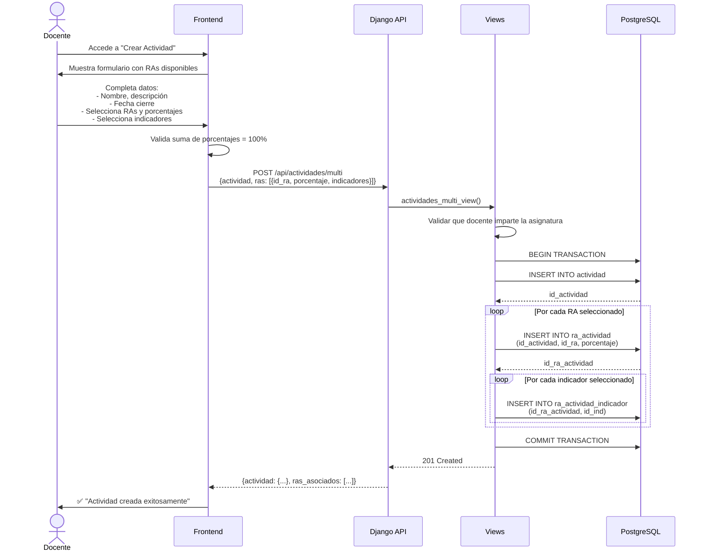

---

### 10.2 Calificación de estudiante por indicador

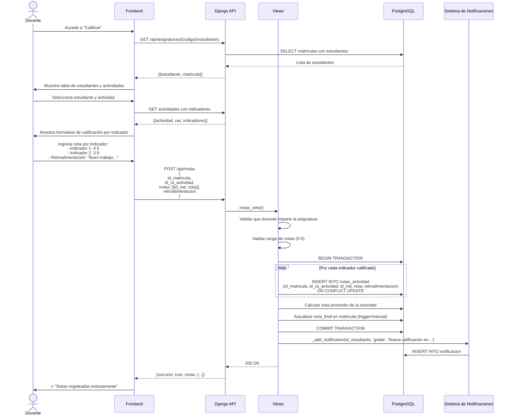

---

### 10.3 Consulta de calificaciones por estudiante

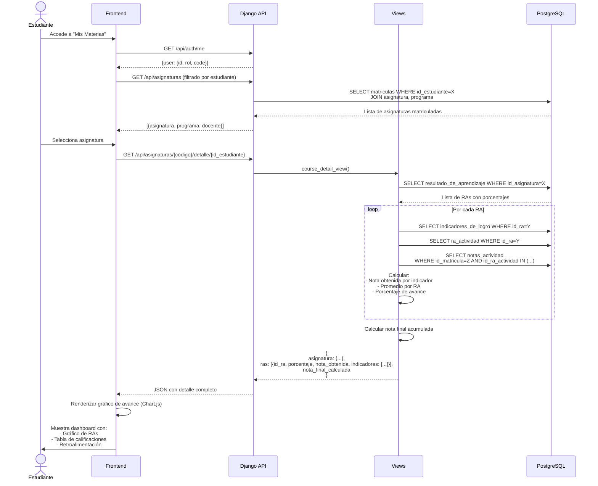

---

## 11. ARQUITECTURA DE MÓDULOS

### 11.1 Estructura del backend Django

```
backend/
├── api/                          # Aplicación principal
│   ├── models/
│   │   └── models.py             # 527 líneas - Todos los modelos
│   │       ├── TipoDocumento, TipoActividad, Programa
│   │       ├── Estudiante, Docente, Coordinador
│   │       ├── Asignatura, ResultadoDeAprendizaje, IndicadoresDeLogro
│   │       ├── Actividad, RaActividad, RaActividadIndicador
│   │       ├── Matricula, NotasActividad
│   │       ├── Recurso, Anuncio, Notificacion
│   │       └── LoginAttempt, AccountLockout, SecurityEvent, ImportAudit
│   │
│   ├── serializers/
│   │   └── serializers.py        # Serialización de datos para API
│   │       ├── TipoDocumentoSerializer
│   │       ├── DocenteSerializer, EstudianteSerializer
│   │       ├── AsignaturaSerializer (con nested objects)
│   │       └── PasswordForgot/Verify/Reset Serializers
│   │
│   ├── views/
│   │   ├── views.py              # ⚠️ 4380 líneas - MONOLÍTICO
│   │   │   ├── Login, logout, me, password recovery
│   │   │   ├── Endpoints de catálogos (ViewSets)
│   │   │   ├── Endpoints de docente (RAs, actividades, calificaciones)
│   │   │   ├── Endpoints de estudiante (consultas, notificaciones)
│   │   │   ├── Endpoints de coordinador (imports, gestión)
│   │   │   └── Endpoints de analítica
│   │   │
│   │   └── utils.py              # Funciones auxiliares
│   │       ├── _bearer_token(), _serialize_user()
│   │       ├── _read_imported_file() (CSV/Excel)
│   │       └── _send_welcome_email()
│   │
│   ├── urls/
│   │   └── urls.py               # Rutas de API (REST + custom endpoints)
│   │
│   ├── middleware/
│   │   ├── error_handler.py      # Error handling centralizado
│   │   │   ├── ErrorHandlerMiddleware (process_exception)
│   │   │   └── RequestLoggingMiddleware
│   │   │
│   │   └── ratelimit.py          # Rate limiting por IP/usuario
│   │
│   └── utils/
│       └── security.py           # 302 líneas - Utilidades de seguridad
│           ├── get_client_ip(), get_user_agent()
│           ├── validate_password_strength()
│           ├── check_user_password()
│           ├── generate_secure_otp()
│           ├── check_account_lockout()
│           ├── registrar_intento_login()
│           └── manejar_intento_fallido()
│
├── backend/                      # Configuración del proyecto
│   ├── settings.py               # 319 líneas - Configuración central
│   │   ├── SECRET_KEY validation
│   │   ├── Database (PostgreSQL)
│   │   ├── CORS (allowed origins)
│   │   ├── Security (HSTS, SSL redirect)
│   │   ├── Logging (RotatingFileHandler)
│   │   └── Middleware stack
│   │
│   ├── urls.py                   # Rutas principales
│   │   ├── /api/ → api.urls
│   │   ├── /admin/ → Django admin
│   │   └── /api/schema/ → drf-spectacular (Swagger)
│   │
│   └── wsgi.py                   # WSGI entry point
│
├── db/                           # Base de datos y scripts SQL
│   ├── db.sqlite3                # SQLite (desarrollo)
│   └── *.sql, *.psql             # Scripts de inicialización
│
├── logs/                         # Archivos de log
│   ├── django.log                # Log general (10MB rotating)
│   └── errors.log                # Solo errores
│
├── media/                        # Archivos subidos
│   ├── avatars/                  # Fotos de perfil
│   └── recursos/                 # Recursos educativos
│
├── manage.py                     # CLI de Django
└── requirements.txt              # Dependencias Python
```

**Dependencias entre módulos:**

```
views.py
  ├── depends on: models.py (importa todos los modelos)
  ├── depends on: serializers.py
  ├── depends on: utils/security.py
  └── depends on: utils.py (funciones auxiliares)

middleware/error_handler.py
  └── depends on: logging (Python stdlib)

middleware/ratelimit.py
  └── depends on: django-ratelimit, models.SecurityEvent

serializers.py
  └── depends on: models.py

models.py
  └── standalone (solo Django)

utils/security.py
  └── depends on: models.LoginAttempt, AccountLockout, SecurityEvent
```

---

### 11.2 Estructura del frontend React

```
frontend/src/
├── main.tsx                      # Entry point (ReactDOM.render)
│   └── Envuelve <App> en <BrowserRouter> y <SessionProvider>
│
├── App.tsx                       # Router principal
│   ├── Define todas las rutas protegidas
│   ├── Componente: ProtectedRoute (verifica rol)
│   └── Redirige según rol en caso de acceso no autorizado
│
├── components/                   # Componentes reutilizables
│   ├── HeaderBar.tsx             # Barra de navegación con perfil
│   ├── Sidebar.tsx               # Menú lateral según rol
│   ├── NotificationsBell.tsx     # Campana de notificaciones
│   ├── Alert.tsx, Toast.tsx      # Mensajes al usuario
│   ├── Spinner.tsx, Skeleton.tsx # Estados de carga
│   ├── ErrorBoundary.tsx         # Captura de errores React
│   ├── ConfirmDialog.tsx         # Diálogos de confirmación
│   ├── GradeSummary.tsx          # Resumen de calificaciones
│   ├── RaCard.tsx                # Tarjeta de Resultado de Aprendizaje
│   ├── StudentList.tsx           # Tabla de estudiantes
│   └── EstudiantePerfilModal.tsx # Modal de perfil de estudiante
│
├── pages/                        # Páginas principales
│   ├── Login.tsx                 # Página de login
│   ├── Recuperar.tsx             # Recuperación de contraseña
│   ├── Reset.tsx                 # Reseteo de contraseña con OTP
│   ├── Profile.tsx               # Perfil de usuario
│   │
│   ├── estudiante/
│   │   └── MateriaDetalle.tsx    # Vista detallada de asignatura
│   │
│   ├── docente/
│   │   ├── Cursos.tsx            # Listado de asignaturas
│   │   ├── RAs.tsx               # Gestión de RAs
│   │   ├── NuevaActividad.tsx    # Crear actividad
│   │   ├── Calificar.tsx         # Calificar estudiantes
│   │   └── Recursos.tsx          # Publicar recursos
│   │
│   └── coordinador/
│       ├── Dashboard.tsx         # Dashboard coordinador
│       ├── Materias.tsx          # Listado de asignaturas
│       ├── Estudiantes.tsx       # Gestión de estudiantes
│       ├── Imports.tsx           # Importaciones masivas
│       ├── Asignatura.tsx        # Vista de asignatura
│       └── AsignaturaAnalisis.tsx# Analítica de asignatura
│
├── services/                     # Servicios de API
│   ├── auth.ts                   # login, logout, getProfile, changePassword
│   ├── api.ts                    # Endpoints generales (asignaturas, RAs)
│   ├── coordinador.ts            # Servicios específicos de coordinador
│   └── index.ts                  # Re-exportación
│
├── connections/                  # Configuración HTTP
│   ├── http.ts                   # Cliente Axios configurado
│   │   ├── api (Axios instance)
│   │   ├── Interceptors (token, CSRF, loading)
│   │   ├── getAuthToken(), setAuthToken(), removeAuthToken()
│   │   └── Manejo de errores
│   │
│   └── endpoints.ts              # Definición de rutas de API
│
├── state/                        # Gestión de estado
│   └── SessionContext.tsx        # Context API para sesión de usuario
│       ├── SessionProvider
│       ├── useSession() hook
│       └── Estado: {id, role, nombre, code}
│
├── hooks/                        # Custom hooks
│   └── [hooks personalizados]
│
├── utils/                        # Utilidades
│   ├── loadingEvents.ts          # Event bus para spinner global
│   └── [otras utilidades]
│
├── types.ts                      # Definiciones de tipos TypeScript
│   ├── UserProfile, ProfileDetails
│   ├── Asignatura, Programa, Docente
│   └── ResultadoAprendizaje, Indicador, Actividad
│
└── styles/                       # Estilos CSS
    └── [archivos de estilos]
```

**Flujo de datos:**

```
Usuario interactúa con página
  ↓
Página llama a servicio (ej: auth.login)
  ↓
Servicio usa http.ts (Axios)
  ↓
http.ts intercepta request (añade token)
  ↓
Request enviado a API backend
  ↓
Response interceptado (maneja errores, loading)
  ↓
Servicio procesa response y retorna datos
  ↓
Página actualiza estado (useState/SessionContext)
  ↓
React re-renderiza componentes
```

---

### 11.3 Flujo de comunicación completo

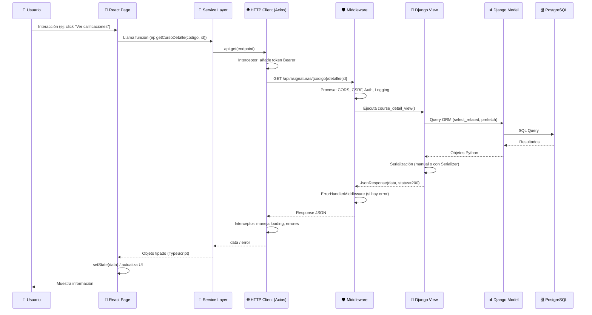

---

## 📊 CONCLUSIONES

Este sistema **RA-Manager** presenta:

✅ **Arquitectura bien estructurada:**
- Separación clara frontend/backend
- Modelos de datos normalizados con integridad referencial
- Sistema de auditoría robusto
- Manejo de errores centralizado

⚠️ **Áreas críticas de mejora:**
- Implementar autenticación real en endpoints (actualmente AllowAny)
- Dividir views.py monolítico en módulos
- Agregar tests automatizados
- Implementar caché para consultas frecuentes

🚀 **Escalabilidad:**
- Con la arquitectura ideal propuesta, el sistema puede escalar a 10,000+ estudiantes
- Requiere implementación de load balancing, read replicas y object storage

---

**Documento generado a partir del análisis del código fuente del proyecto RA-Manager**  
**Para uso interno del equipo de desarrollo**

---

## ANEXO: LISTADO COMPLETO DE ENDPOINTS

| Endpoint | Método | Descripción | Rol |
|----------|--------|-------------|-----|
| `/api/auth/login` | POST | Autenticación de usuario | Público |
| `/api/auth/me` | GET | Obtener usuario actual | Auth |
| `/api/auth/logout` | POST | Cerrar sesión | Auth |
| `/api/auth/profile` | GET, PUT, PATCH | Ver/editar perfil | Auth |
| `/api/auth/password/forgot` | POST | Solicitar OTP de recuperación | Público |
| `/api/auth/password/verify-otp` | POST | Verificar código OTP | Público |
| `/api/auth/password/reset` | POST | Resetear contraseña con OTP | Público |
| `/api/auth/password/change` | POST | Cambiar contraseña | Auth |
| `/api/auth/profile/avatar` | POST | Subir avatar | Auth |
| `/api/tipos-documento` | GET, POST | CRUD tipo documento | Admin |
| `/api/tipos-actividad` | GET, POST | CRUD tipo actividad | Admin |
| `/api/programas` | GET, POST | CRUD programas | Admin |
| `/api/docentes` | GET, POST | CRUD docentes | Admin |
| `/api/estudiantes` | GET, POST | CRUD estudiantes | Admin |
| `/api/asignaturas` | GET, POST | CRUD asignaturas | Docente/Admin |
| `/api/ras/{id_ra}/indicadores/` | GET, POST | Gestión de indicadores | Docente |
| `/api/ras/{id_ra}/indicadores/{id_ind}/` | GET, PUT, DELETE | CRUD indicador específico | Docente |
| `/api/ras/{id_ra}/actividades/` | GET, POST | Actividades de un RA | Docente |
| `/api/ras/{id_ra}/actividades/{rel_id}/` | PATCH, DELETE | Editar/eliminar RA-Actividad | Docente |
| `/api/actividades/multi` | POST | Crear actividad con múltiples RAs | Docente |
| `/api/notas` | POST, PUT | Ingresar/editar notas | Docente |
| `/api/asignaturas/{codigo}/estudiante/{id}/indicadores` | GET | Indicadores de estudiante | Docente/Estudiante |
| `/api/asignaturas/{codigo}/calificaciones/{id}/` | GET | Calificaciones consolidadas | Docente/Estudiante |
| `/api/asignaturas/{codigo}/detalle/{id}/` | GET | Detalle completo de asignatura | Estudiante |
| `/api/asignaturas/{codigo}/analitica/` | GET | Analítica de asignatura | Coordinador |
| `/api/asignaturas/{codigo}/actividades-agrupadas/` | GET | Actividades sin duplicación | Docente |
| `/api/notificaciones` | GET | Notificaciones del estudiante | Estudiante |
| `/api/validacion/ra/{id_ra}` | GET | Validar porcentajes de RA | Docente |
| `/api/validacion/asignatura/{codigo}` | GET | Validar asignatura completa | Docente |
| `/api/periodos/actual` | GET | Periodo académico actual | Auth |
| `/api/coordinador/estudiantes` | GET, POST | Gestión de estudiantes | Coordinador |
| `/api/coordinador/estudiantes/{id}/perfil` | GET | Perfil completo de estudiante | Coordinador |
| `/api/coordinador/asignaturas` | GET | Todas las asignaturas | Coordinador |
| `/api/coordinador/asignaturas/estudiantes` | GET | Estudiantes por asignatura | Coordinador |
| `/api/coordinador/asignaturas/ras` | GET | RAs por asignatura | Coordinador |
| `/api/coordinador/asignaturas/avance` | GET | Avance por asignatura | Coordinador |
| `/api/coordinador/import/matriculados` | POST | Importar matrículas CSV | Coordinador |
| `/api/coordinador/import/docentes` | POST | Importar docentes CSV | Coordinador |
| `/api/coordinador/import/estudiantes` | POST | Importar estudiantes CSV | Coordinador |
| `/api/coordinador/import/asignaturas-ras` | POST | Importar asignaturas y RAs | Coordinador |
| `/api/docente/asignaturas/{codigo}/import/estudiantes` | POST | Importar estudiantes (docente) | Docente |
| `/api/docente/buscar-estudiante` | GET | Buscar estudiante por código | Docente |
| `/api/docente/asignaturas/{codigo}/estudiantes` | POST | Agregar estudiante individual | Docente |
| `/api/anuncios/{id}/` | DELETE | Eliminar anuncio | Docente |

---

**FIN DE LA DOCUMENTACIÓN ARQUITECTÓNICA**
